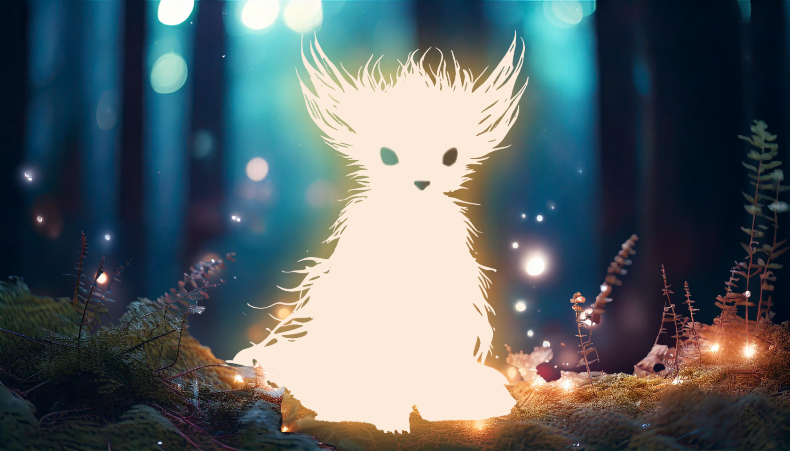

# Aurúmitas

Al adentraros en Névoran, el plano existencial de nuestro mundo, conoceréis a las inteligentes Aurúmitas. Cada una es diferente, y su esencia es moldeada por un arquetipo que define a cada raza. Si compartís afinidad con una de estas criaturas, podréis firmar un contrato mágico que no solo os otorgará poder, sino que creará un vínculo profundo y duradero.

* [Web Valentí Gàmez](https://valentigamez.com)

* [Ver otros temas](/)

* [Guía ética](/guia_etica.md)

* [Volver al inicio del archivo](/nevoran/README.md)

* [Índice](./README.md)

* [Pacto Mágico](./pacto_magico.md)

* [Licencia "Llama del Fénix" v1.1](/nevoran/LICENSE.md)
