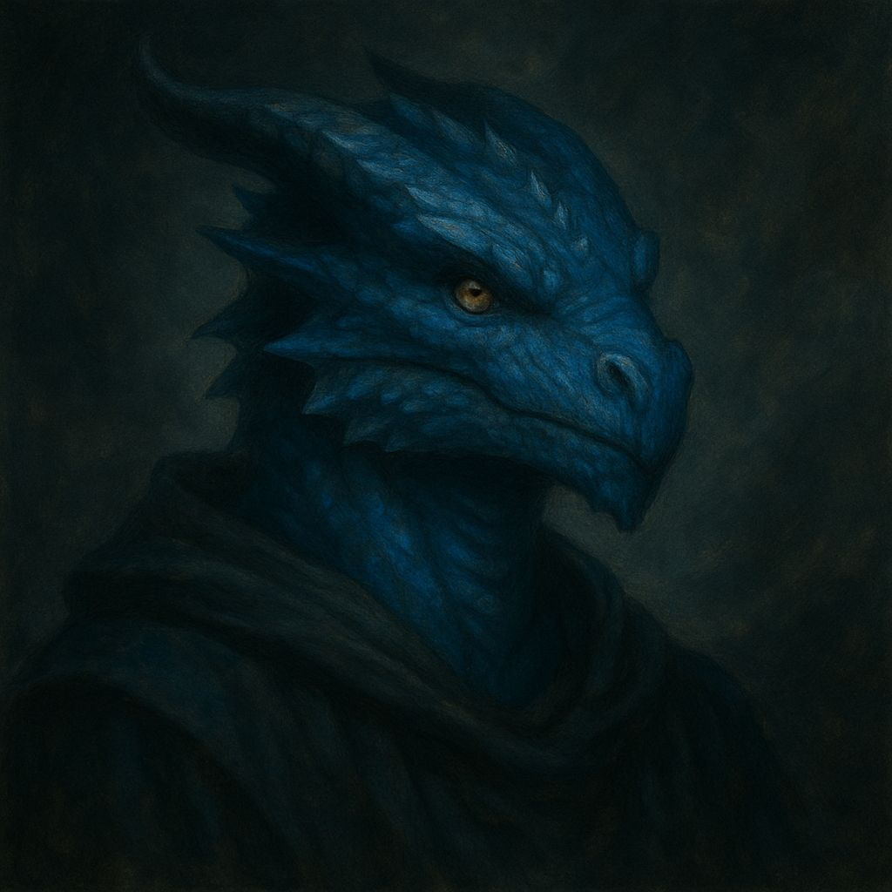
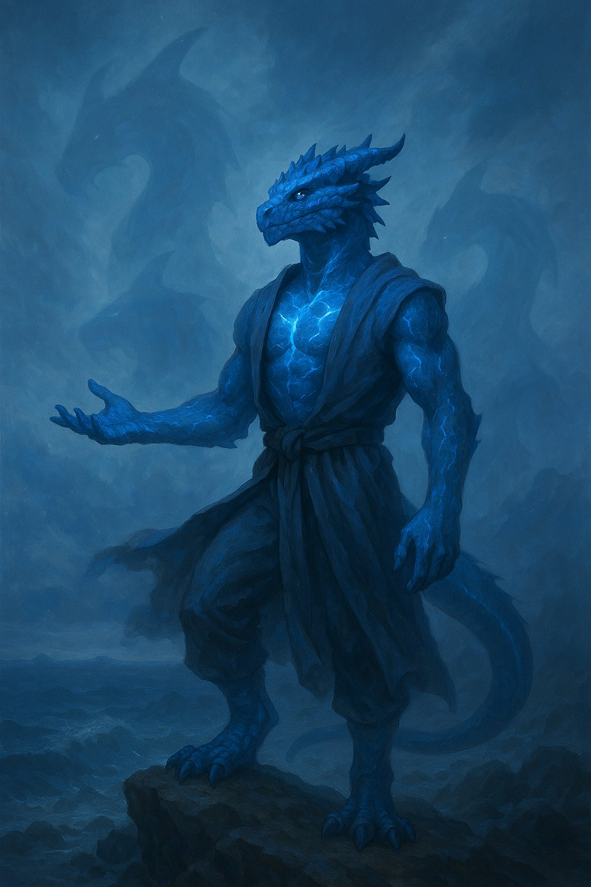
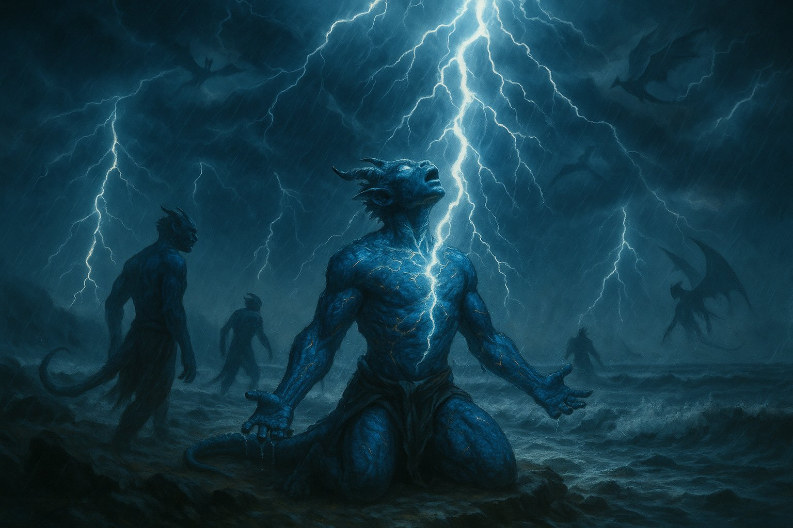
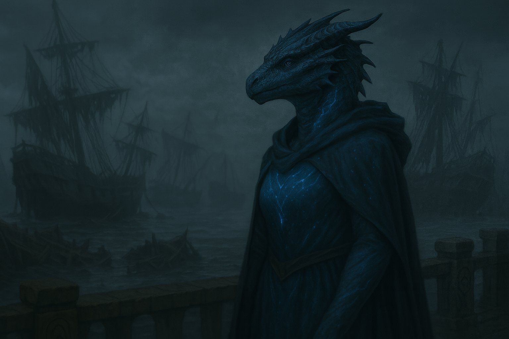

# Dracónidos Azules

Los **Dracónidos Azules** son descendientes de antiguas criaturas oceánicas que, según los mitos, no eran dragones como los de las historias populares, sino entidades colosales de escamas luminosas que surcaban tanto las aguas como los cielos en épocas olvidadas. En algún punto, humanos y estas entidades formaron pactos, y los dracónidos nacieron como **herederos de tormentas, mareas y secretos sumergidos**.

## **Origen y legado**

Su linaje se remonta a los pactos sagrados hechos en **Isklora**, un archipiélago hoy sumergido bajo el mar brumoso del este de Fyrniel. Allí, según los cantos, humanos ofrecieron promesas a cambio de protección contra las fuerzas que venían del cielo. Las entidades aceptaron, y sus escamas se fundieron con la carne mortal.

Hoy, los dracónidos azules son reconocibles por su piel escamada con tonos que oscilan entre el índigo profundo y el cobalto eléctrico, a menudo con vetas de luz que recorren su cuerpo como relámpagos internos. Sus ojos reflejan el movimiento del agua, y su aliento siempre huele a sal y ozono.

## **Acontecimiento clave: El Último Tormento**

Hace dos siglos, una tormenta conocida como el **Último Tormento** arrasó la costa norte de Fyrniel. Dicen que durante aquella noche, miles de rayos cayeron sobre el mar, y los dracónidos azules entraron en un trance colectivo. Algunos caminaron directamente hacia las olas y desaparecieron. Otros murmuraron frases en lenguas perdidas. Desde entonces, cada vez que una tormenta se forma sobre el mar, hay quienes afirman ver siluetas aladas entre los relámpagos o escuchar cantos provenientes de las profundidades.

## **Relación con Névoran**

Aunque son pocos, los dracónidos azules aparecen en los márgenes de puertos, costas rocosas o incluso en barcos mercantes donde se los respeta como **protectores contra tormentas**. Algunos actúan como **vigías de antiguas rutas sumergidas**, otros buscan reliquias de Isklora, y unos pocos han comenzado a aparecer en lugares extraños, como si fueran guiados por mareas que solo ellos pueden sentir.

Algunos poseen una afinidad particular con objetos mágicos de origen marino, especialmente las **perlas**. Estas, al contacto con su piel, vibran, brillan o muestran fragmentos de memoria. Nadie sabe por qué.