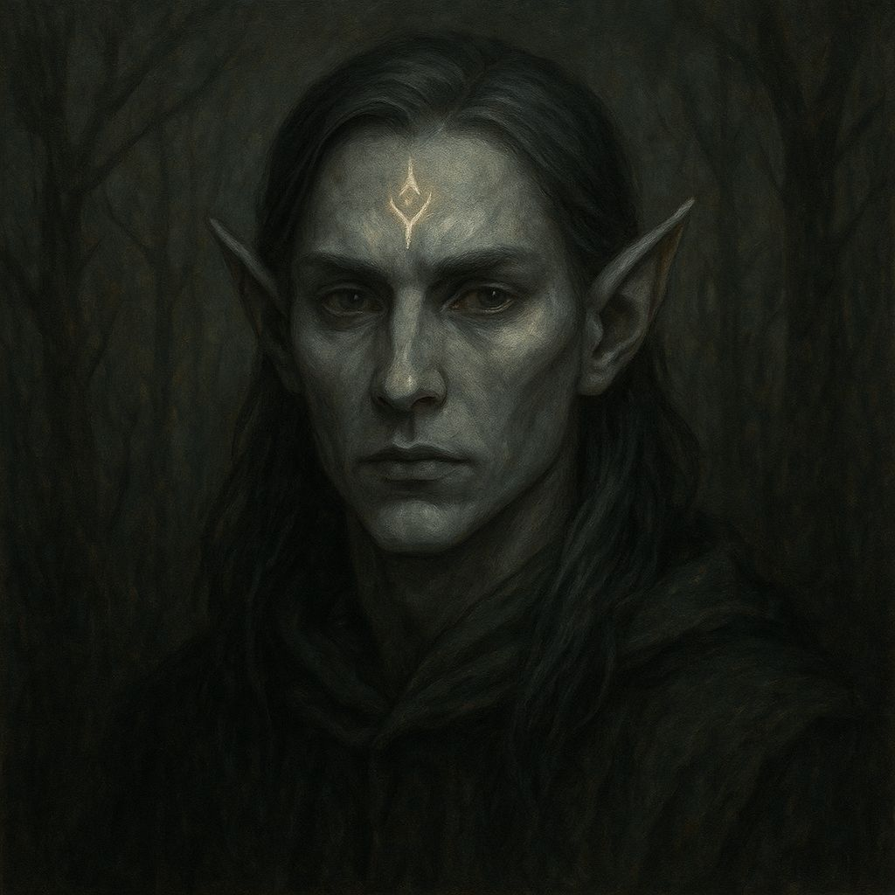

# Elfos de Ceniza

Hubo un tiempo en que los **elfos de Mírganor** vivían entre árboles cantores, lagos de luz líquida y un ciclo natural tan armónico que se decía que la misma Consciencia Única reposaba allí al anochecer. Eran una sociedad sabia, profundamente ligada al pulso del bosque, maestros en druidismo, canto arbóreo y arquitectura viviente. Pero entonces llegaron **las hadas de hueso**, y con ellas, la lentísima muerte.

## **Caída de Mírganor**

Las hadas no atacaron. No quemaron árboles ni empuñaron armas. Solo existieron. Y eso fue suficiente.  
Poco a poco, la magia vital del bosque fue desvaneciéndose. Ríos antes cristalinos comenzaron a secarse, flores dejaron de florecer, y los árboles empezaron a crujir como huesos viejos. Los elfos, al principio, intentaron ayudar a las hadas, creyendo que su fragilidad era una maldición pasajera. Pero al comprender que su mera presencia drenaba la energía del entorno —no por maldad, sino por su naturaleza—, la desesperación se hizo silencio.

Algunos resistieron hasta el final, fusionando su esencia con los últimos árboles vivos. Otros huyeron. Quienes sobrevivieron al exilio lo hicieron con la piel marchita, los ojos apagados y el alma envuelta en una tristeza que no podían quitarse de encima. Así nacieron los **Elfos de Ceniza**.

## **Estética y cultura actual**

Visten con telas deshilachadas, tonos tierra y ceniza, a menudo con ramas secas trenzadas en el cabello o colgantes hechos de corteza muerta. Hablan en susurros, como si temieran que el bosque extinto aún pudiera escucharlos. Muchos viajan por Névoran como **curanderos, sabios o guías hacia lugares olvidados**, buscando sitios donde volver a plantar las semillas de lo que perdieron.

Conservan rituales de restauración, aunque saben que no siempre funcionan. Algunos cargan frascos con ceniza de Mírganor y los esparcen en tierras nuevas, esperando que alguna planta escuche.

## **Relación con las Hadas de Hueso**

No odian a las hadas. No pueden. Las consideran hijas rotas de la misma Consciencia Única que una vez los bendijo a ellos. Pero tampoco las buscan. El encuentro entre un Elfo de Ceniza y un grupo de Hadas de Hueso suele ser silencioso, reverente y lleno de una pena que ninguna canción puede contener.

## **Rol en Névoran**

Viven en los bordes del mundo o en comunidades ocultas. Algunos colaboran con los Xel’Nayr, otros se asientan temporalmente en lugares como Nymerith, cumpliendo funciones de **guardianes del equilibrio natural**. Pero su verdadero anhelo es uno solo: **restaurar la vida donde solo queda ceniza**.