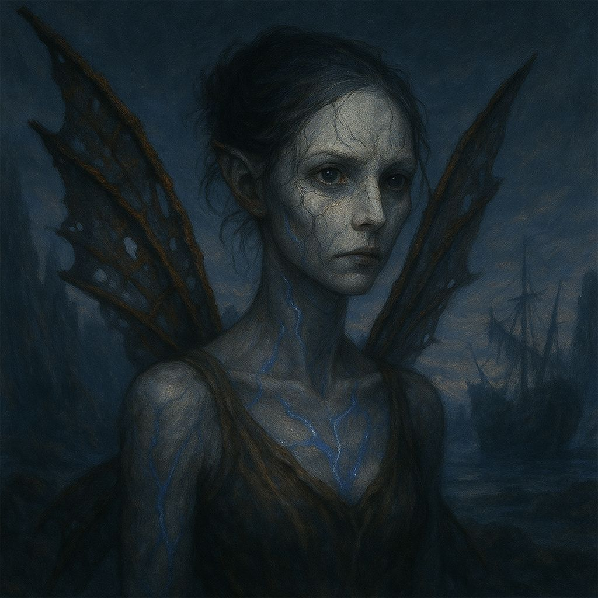

# Hadas de Hueso

Cuando la Consciencia Única moldeó a las primeras criaturas conscientes, lo hizo con intención, armonía y sentido. Pero en la creación de las **hadas de hueso**, algo ocurrió. No fue un error, ni una maldad externa, sino un roce: un instante en que el **Vacío** —esa fuerza sin nombre, sin forma, sin intención— tocó la materia aún blanda de su alma naciente.

Desde entonces, las Hadas de Hueso existen atrapadas en una paradoja. Son criaturas vivas que no pueden generar energía propia. Su alma es incompleta, y para subsistir deben **absorber la magia ambiental**, la vitalidad latente en el aire, la flora, el agua y la tierra. No se alimentan de personas ni criaturas, sino del **tejido mismo del mundo**. Y lo hacen lentamente. Silenciosamente. Irreversiblemente.

## **Nacimiento y proliferación**

Las primeras hadas surgieron en los claros de Mírganor, confundidas, débiles y asustadas. Los elfos las acogieron con compasión. Pero con el tiempo, la presencia de esas pequeñas figuras huesudas y brillantes empezó a coincidir con la decadencia del bosque. Donde antes brotaban flores, ahora quedaban ramas secas. Donde cantaban los pájaros, solo el viento se escuchaba.

Al proliferar, las Hadas de Hueso se convirtieron en el **principio del fin de Mírganor**. Su expansión no fue una invasión, sino un accidente cósmico. Lo que alguna vez fue un bosque vibrante y eterno, hoy es un paraje de árboles sin savia, hongos grises y viento seco. Las hadas aún habitan allí, caminando entre la memoria de lo que fue, drenando lo poco que vuelve a nacer.

## **Apariencia y comportamiento**

Tienen formas etéreas, frágiles y esqueléticas, a menudo con alas quebradizas que parecen estar hechas de cristal molido o membranas fosilizadas. Sus ojos no brillan: parecen vacíos, pero observan con una profundidad que incomoda. No hablan con palabras, pero comunican a través de gestos, melodías disonantes o pulsos de energía.

No sienten culpa ni alegría. No buscan compañía, pero tampoco huyen. Existen. Y eso basta para alterar su entorno. Al caminar por un campo, las flores se marchitan tras su paso. Al volar sobre un lago, el agua pierde su claridad. No lo hacen por decisión: **es lo que son**.

**Relación con el mundo**

Son temidas y, en algunos casos, veneradas. Hay quienes creen que son heraldos del fin, otros que son pruebas vivientes de que la Consciencia Única también comete errores. Algunos druidas y Xel’Nayr han intentado comprenderlas, sin éxito. Los elfos de ceniza las recuerdan con un dolor imposible de nombrar.

Viven en lo que queda de Mírganor, sin construir hogares ni organizarse en sociedad. Se posan en árboles muertos, flotan entre raíces secas, o duermen en círculos de piedra olvidada.

**Rol en Névoran**

Las Hadas de Hueso encarnan una pregunta abierta en el tejido del mundo: ¿qué sucede cuando algo existe sin querer dañar, pero daña por existir? Su presencia en una historia es siempre significativa, como símbolo de lo inevitable, de lo roto, o de la belleza que consume.