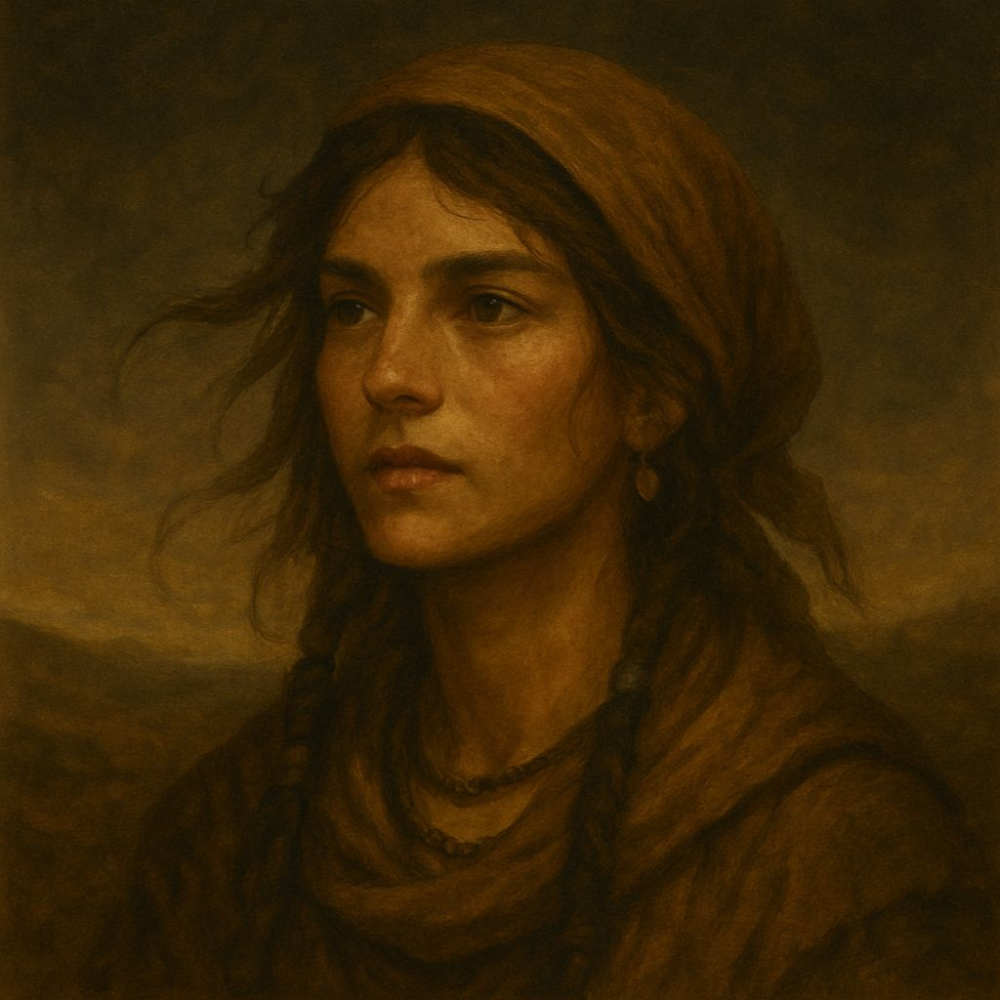
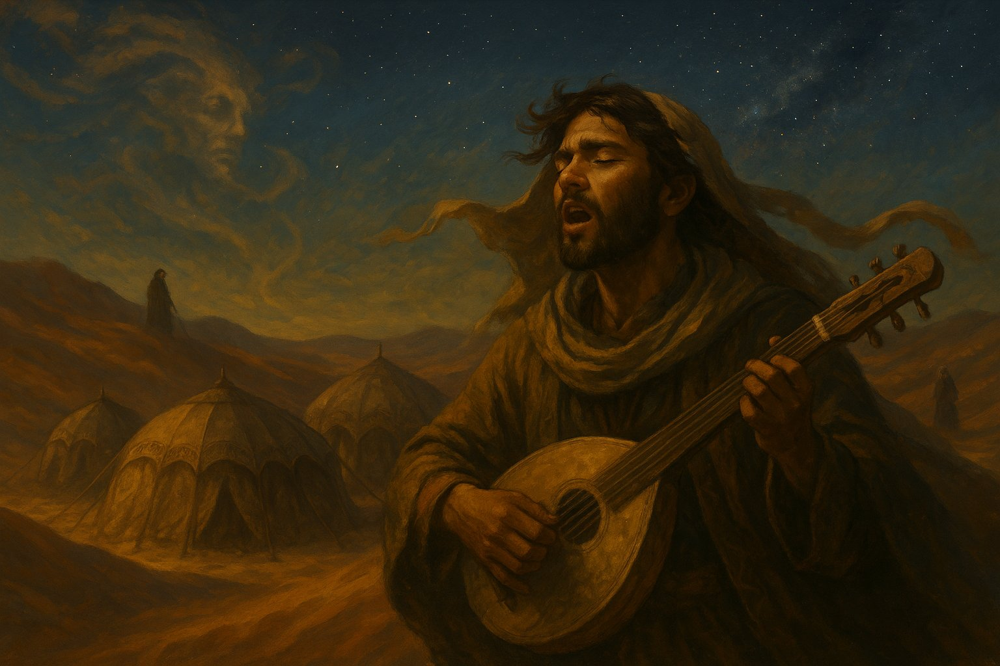
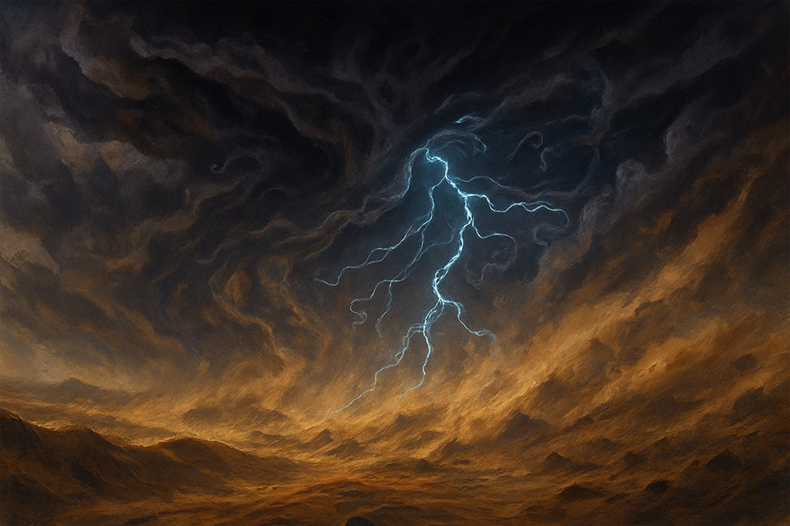
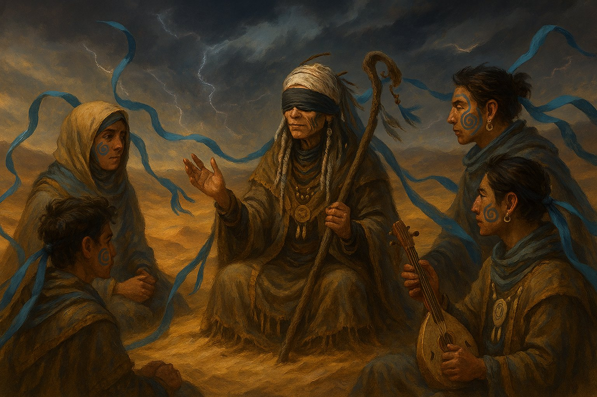
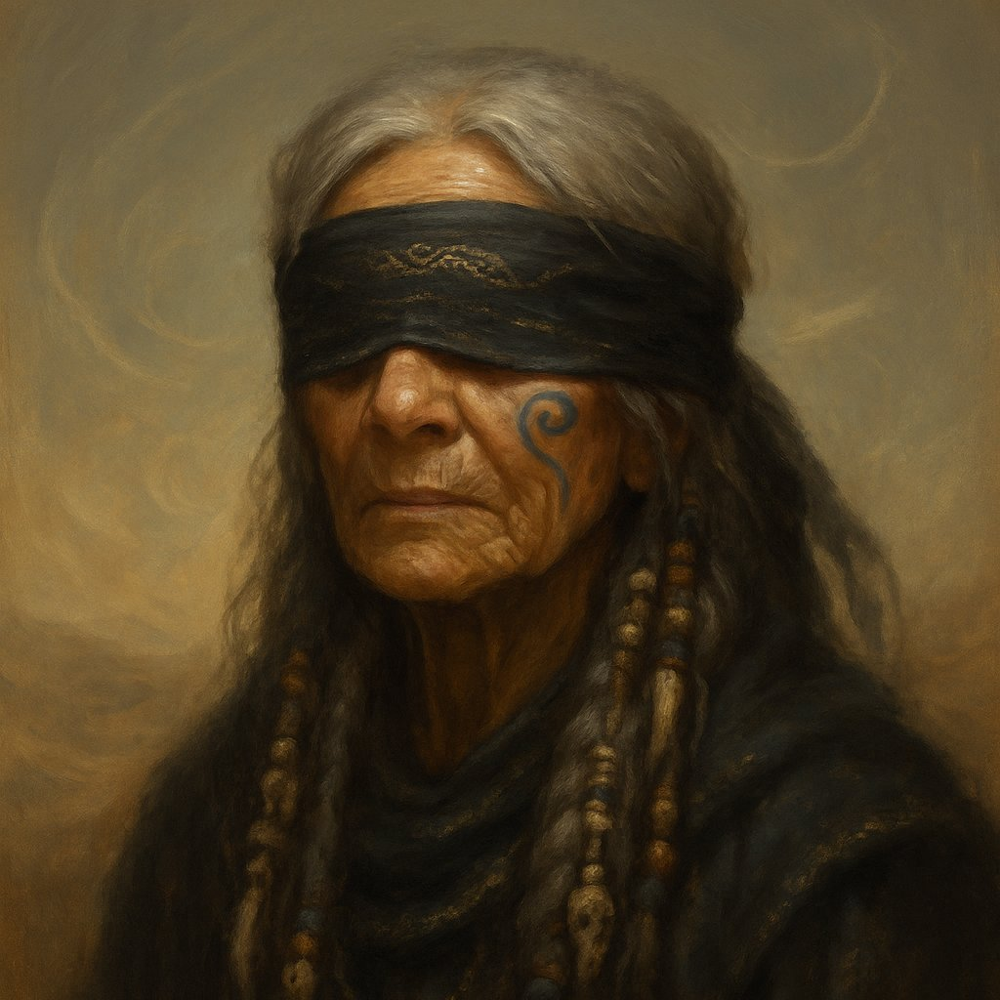
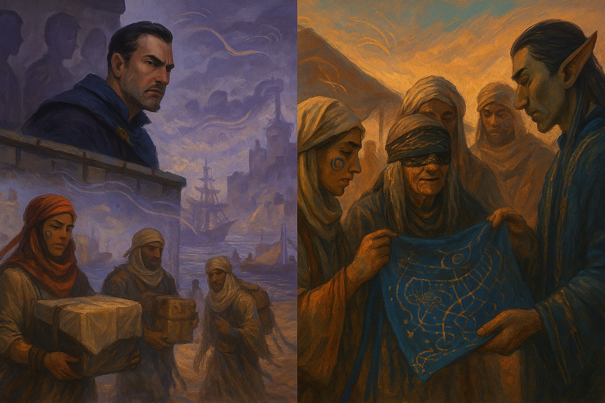

# **Humanos Nómadxs de Kormirth**, Kormayim

En los confines del mundo conocido, más allá de las rutas comerciales seguras y los mapas oficiales, se extiende el **desierto de Kormirth**, una inmensidad ondulante de arena, roca y sal. Allí viven los **humanos nómadxs**, un pueblo antiguo que eligió moverse en lugar de echar raíces, cuyas ciudades son carpas plegables y cuyos hogares cambian con el viento.

## **Orígenes y cosmovisión**

Se cree que los nómadxs descienden de tribus humanas que, en tiempos antiguos, huyeron de guerras mágicas libradas en el norte. Se refugiaron en el desierto, creyendo que el calor extremo, las criaturas enterradas en la arena y los espejismos los protegerían de la codicia de los imperios. Con el tiempo, dejaron de huir: aprendieron a leer los signos del sol, a seguir a las estrellas y a escuchar los susurros del viento, que para ellos es un dios cambiante llamado **Zarim**.

No tienen escritura permanente: su historia se transmite en forma de **“sendas cantadas”**, canciones rituales que recorren eventos, linajes y coordenadas, codificadas en melodía. Algunos bardos nómadxs son tan precisos que pueden guiar a una caravana entera solo cantando.

## **Acontecimiento clave: La Tormenta de las Mil Voces**

Hace tres generaciones, una tormenta sin precedentes cubrió el cielo durante trece días. Se dice que los vientos gritaban en lenguas desconocidas y que las arenas sepultaron un oasis entero, junto con cinco clanes. Solo uno sobrevivió: los **Zarei**, guiados por una anciana ciega que afirmaba escuchar las voces de sus antepasados en la tormenta. Desde entonces, los Zarei son considerados oráculos por las otras caravanas, aunque ellos nunca reclaman ese título.

### **Los Zarei**

Cada Zarei lleva al menos una cinta larga atada al brazo, cuello o instrumento. Estas cintas tienen bordados de sendas cantadas, con símbolos personales heredados de sus ancestros. Cuando el viento sopla, las cintas “cantan” al rozar entre sí. Llevan pinturas tribales en la cara, un diseño en espiral que comienza en la sien y se extiende hacia la mejilla izquierda, pintado con arcilla azul ceniza. Representa la escucha profunda del viento. También llevan accesorios de hueso blanco pulido, especialmente colgantes y hebillas talladas con nombres o frases breves en lengua antigua. Cada uno representa un recuerdo rescatado de la tormenta.

#### **Arih’Nara, Oído del Silencio**

Sabia ciega del clan Zarei, única sobreviviente adulta de la Tormenta de las Mil Voces.  
Se dice que escucha a los ancestros a través del viento y que sus palabras pueden calmar la arena.  
Los suyos no la veneran, pero nunca la contradicen.  
Donde ella camina, el silencio se vuelve canto.

## **Relación con el resto de Névoran**

Son vistos con respeto y desconfianza. Para algunos, son **traficantes de artefactos antiguos**; para otros, sabios nómadxs que han visto cosas que nadie debería ver. Se rumorea que algunos de sus líderes han comerciado incluso con Xel’Nayr, y que hay mapas en su poder que señalan rutas a través del mundo invisible.