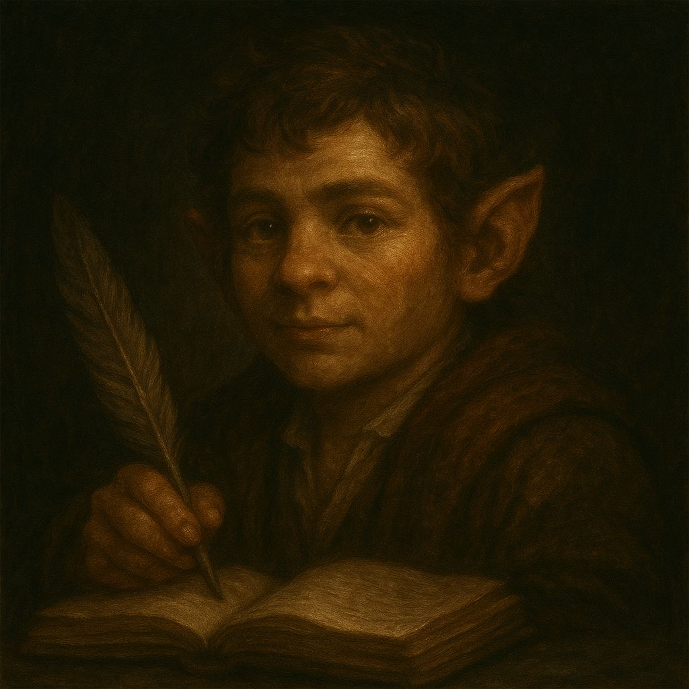
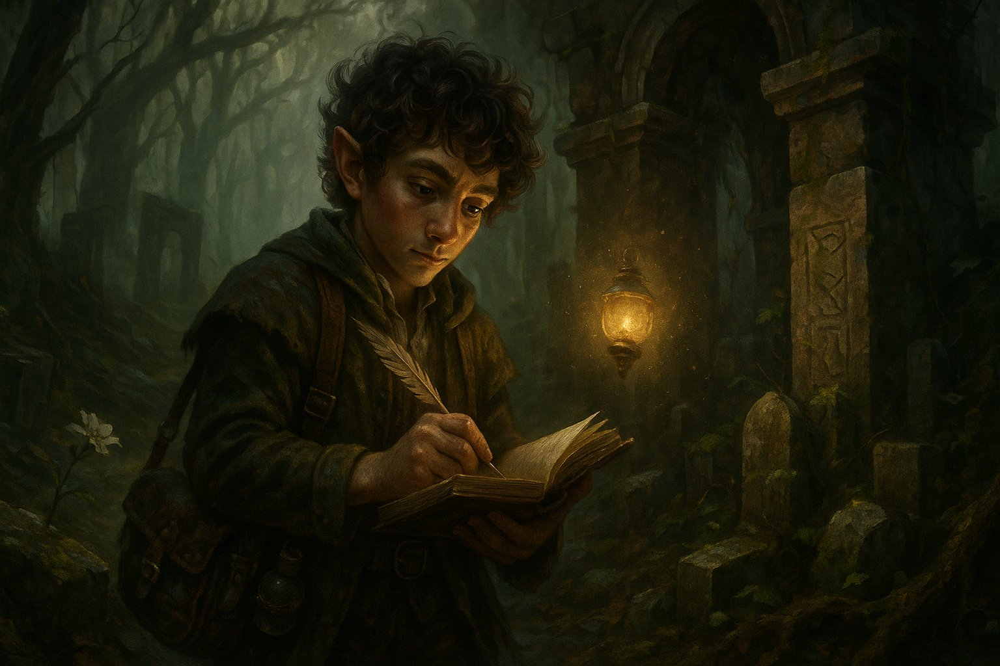
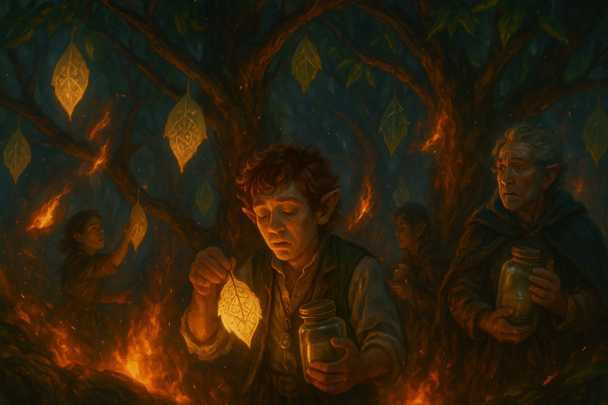
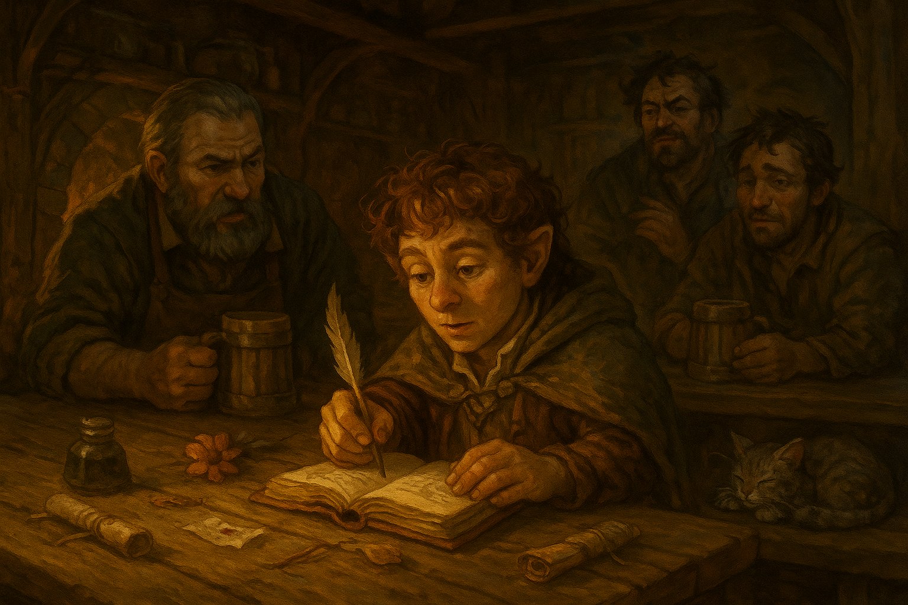

# Medianos Cronistas

Pequeños en estatura, pero colosales en curiosidad, los **medianos cronistas** son una raza errante que ha hecho de la memoria su hogar. Mientras otras culturas construyen templos o levantan fortalezas, ellos levantan relatos. Vagan por Névoran con el único propósito de **registrar aquello que está a punto de ser olvidado**.

## **Origen y vocación**

Cuenta la leyenda que los primeros medianos fueron creados por la Consciencia Única como ecos vivos del mundo: seres diseñados para recordar lo que el tiempo, la guerra o el dolor querrían enterrar. Algunos creen que surgieron tras una gran pérdida colectiva —una guerra de la que nadie conserva registros— y desde entonces se niegan a dejar que algo así vuelva a repetirse.

A diferencia de los humanos, no transmiten la historia por sangre ni por nación, sino por elección. Un mediano puede adoptar a otro como aprendiz si demuestra sensibilidad para los detalles olvidados: una flor que crece sobre una tumba sin nombre, una canción que se toca solo en funerales antiguos, o los últimos restos de una lengua muerta.

## **Acontecimiento clave: La Biblioteca de Hojas**

Uno de los hechos más sagrados de su historia es la caída de la **Biblioteca de Hojas**, una estructura viviente tejida entre ramas de un bosque que ya no existe. Se decía que cada hoja contenía un recuerdo, y que al caer al suelo se perdía para siempre. Cuando un incendio (que algunos atribuyen a la expansión de las Hadas de Hueso) arrasó el bosque, los medianos lograron rescatar solo un puñado de esas hojas. Desde entonces, las portan en colgantes de vidrio, como recordatorio de su misión.

## **Relación con el resto de Névoran**

Suelen ser confundidos con bardos, o incluso hay gente que los relaciona a alguna aventura de los Sil’kai, aunque ellos insisten en que no adornan la verdad: **la transcriben**. Son bienvenidos en tabernas y bibliotecas, aunque a veces considerados molestos por su obsesión con los detalles. Algunos trabajan como escribas en ciudades como Nymerith, mientras otros se infiltran en ruinas, campos de batalla o templos prohibidos solo para dejar constancia de lo que encuentran.

Muchos consideran que su mera presencia es un presagio: **si hay un mediano tomando nota, es porque algo importante está por morir**.