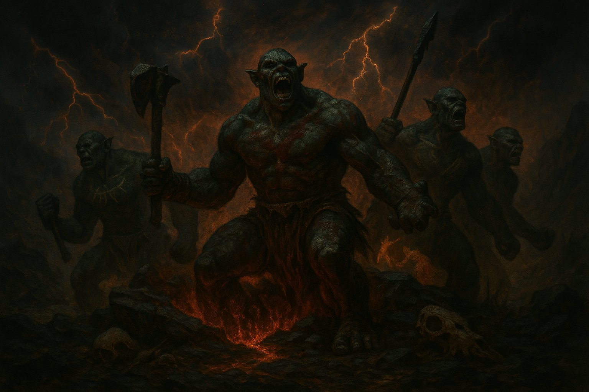
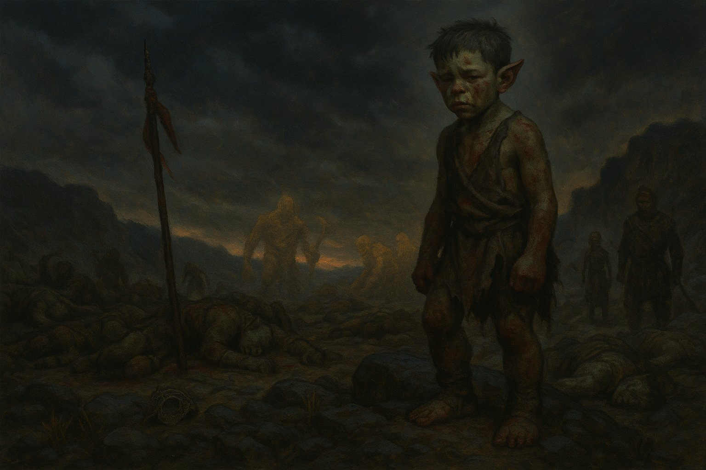
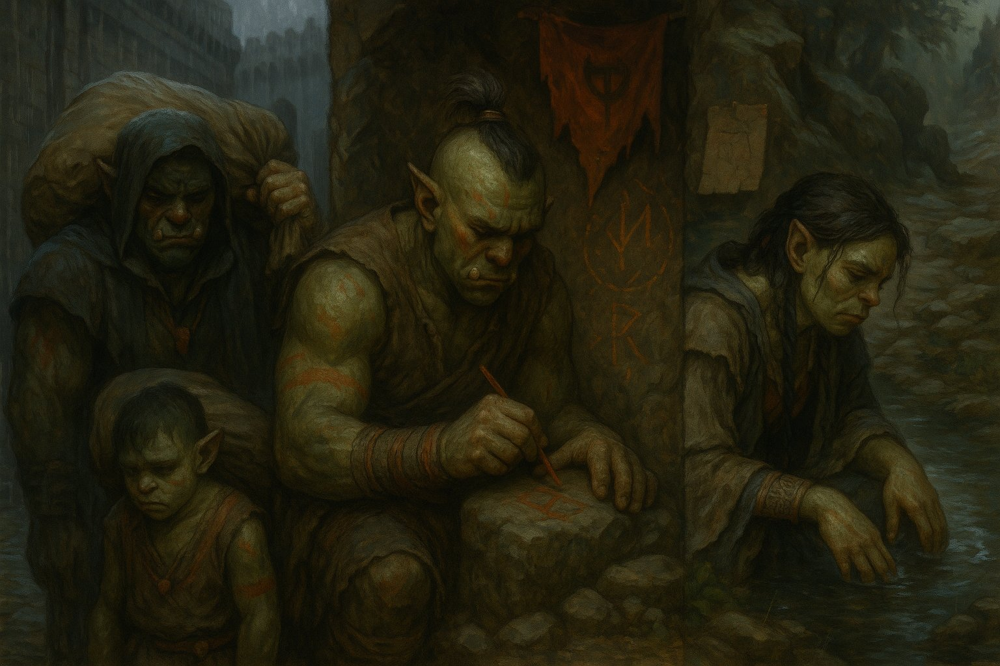

# Orcos, **Las Bestias del Primer Grito**

Antes de que existiera escritura entre los humanos, antes de que los Xel'Nayr moldearan arte con emociones, **los orcos ya rugían contra el cielo**. Nacieron —según algunas leyendas— de la tierra misma, como si Névoran hubiese escupido su furia en forma de carne y hueso. No sabían cultivar, pero sabían cazar. No sabían rezar, pero sus cantos de guerra hacían temblar las montañas.

No eran malvados. **Eran urgentes.**  
Criaturas de una época donde todo era caos, clanes nómades errantes que se enfrentaban tanto al mundo como entre ellos. Su fuerza era brutal, su magia primitiva, ligada al cuerpo, al grito, al golpe del tambor en el pecho.

## **Nombre infame: “Bestias del Vacío”**

El apodo no surgió por un vínculo real con el Vacío, sino por **el miedo que provocaban**. Cuando una aldea era arrasada por una horda orca, los sobrevivientes decían que sus ojos estaban vacíos, que no hablaban, que no dejaban nada. Ese mito se expandió más rápido que la verdad, y el nombre quedó.

## **Acontecimiento clave: La Masacre de Gar'Kaul**

En los registros más antiguos conservados por los Sil’kai, se menciona una guerra entre siete clanes orcos. Durante una sequía prolongada, sin alimento ni rutas de escape, los líderes eligieron enfrentarse entre sí. **Cinco clanes fueron exterminados**, y los dos sobrevivientes se fusionaron bajo un pacto de sangre y rabia. La masacre fue tan intensa que se dice que la tierra de Gar'Kaul aún sangra cuando llueve.

Ese evento marcó el punto de inflexión. Algunos orcos comenzaron a **cuestionar su naturaleza**, a preguntarse si la furia era su esencia o su condena.

## **Dispersión y fractura cultural**

Con el paso del tiempo, la mayoría de los clanes orcos se disolvieron, perseguidos o marginados. Algunos se volvieron mercenarios, otros fueron esclavizados. Pero un pequeño grupo eligió una tercera vía: **refugiarse en la introspección**, domar su furia y buscar un propósito más allá de la violencia.

De ahí surgirían, generaciones después, los **Orcos Místicos**.