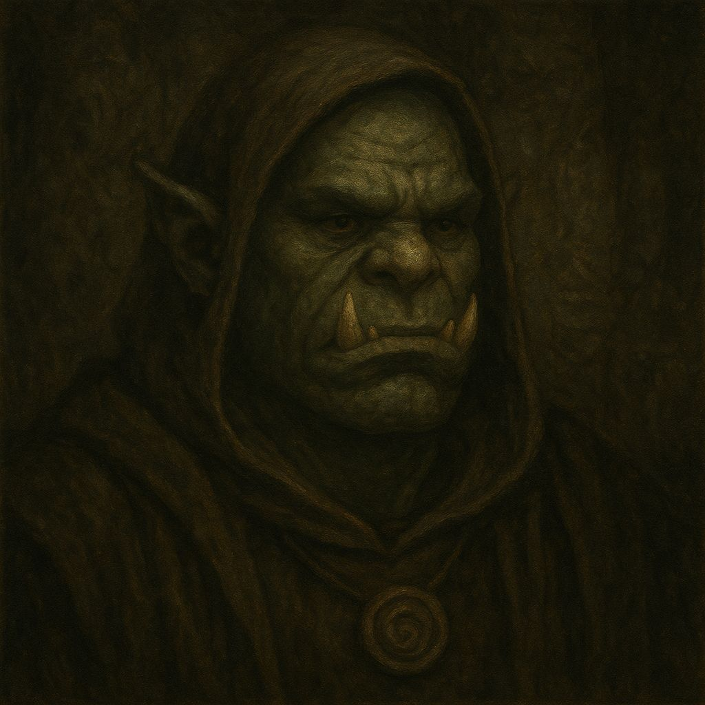
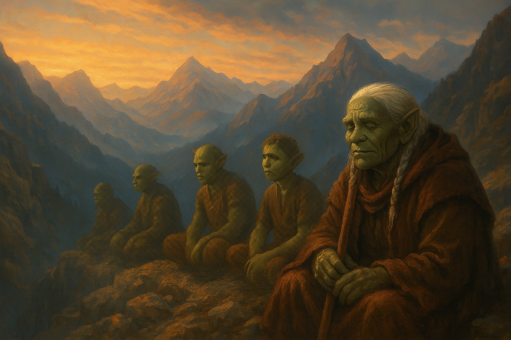
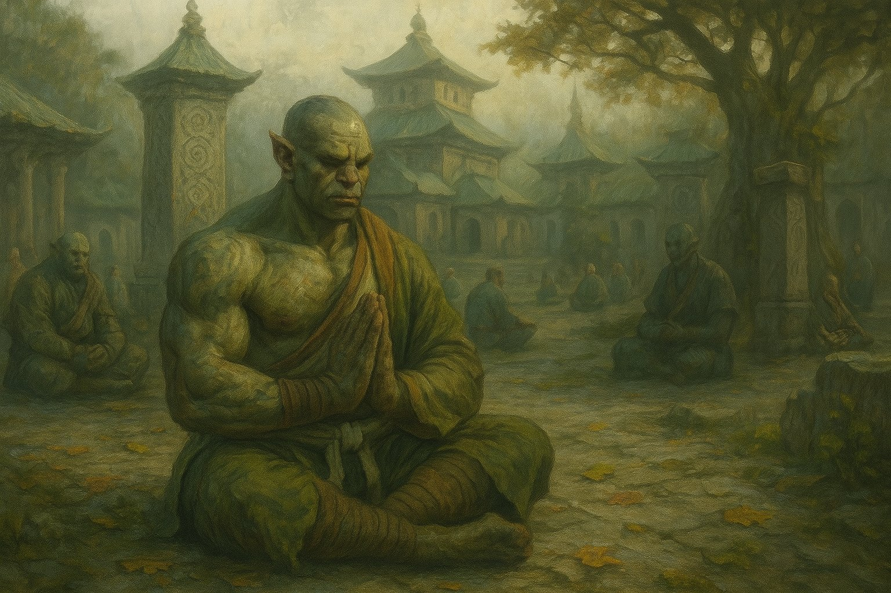

# Orcos Místicos

Nacidos del linaje más temido de Névoran, los **Orcos Místicos** son descendientes de antiguos guerreros que, tras siglos de sangre y caos, eligieron un camino improbable: **domar la furia sin extinguirla**. No la niegan, no la esconden. La veneran. Pero como a un fuego sagrado que debe mantenerse contenido.

## **Orígenes: La Senda del Silencio Rojo**

Luego de la Masacre de Gar’Kaul, un pequeño grupo de orcos sobrevivientes se internó en lo profundo de las montañas del este, allí donde el eco se distorsiona y las tormentas no tocan el suelo. Durante años, vivieron sin hablar, comunicándose solo con gestos, respiraciones y movimientos rítmicos.

Fue en ese retiro donde surgió la **Senda del Silencio Rojo**, una disciplina espiritual que enseñaba a **transmutar la rabia en energía vital**. Usaban danzas marciales, tatuajes rituales y respiración cíclica para canalizar la fuerza destructiva que los había definido como raza.

## **Vínculo con los templos**

Con el tiempo, algunos de estos orcos fueron aceptados como aprendices en el templo de **Zhandao Nerei** y otros templos similares, donde los sabios no vieron en ellos bestias, sino fuego contenido. Allí, los Orcos Místicos adoptaron parte de la filosofía del templo, fusionando la Senda del Silencio con el entrenamiento físico, espiritual y emocional de los monjes.

Hoy, los que entrenan en Zhandao visten **la túnica verde agua**, al igual que los demás, aunque su presencia siempre es sentida. Cuando un orco se mueve en silencio, todo el templo escucha.

## **Estética y presencia**

Llevan el cuerpo tatuado con símbolos de contención, algunos en forma de cadenas rotas, espirales que se cierran o llamas invertidas. Su mirada suele ser intensa, no porque busque intimidar, sino porque está enfocada hacia adentro. Muchos llevan el cabello largo atado, los costados rapados y cicatrices visibles que no ocultan.

## **Relación con el mundo**

Para la mayoría de Névoran, los orcos siguen siendo vistos como **“Bestias del Vacío”**, una injusticia que los místicos aceptan como parte de su karma ancestral. No buscan redención: **buscan equilibrio**. No viven para demostrar nada a nadie, sino para mantener viva una llama que no queme a los que aman.

Algunos sirven como **protectores de artefactos peligrosos, instructores de control emocional o guías a través de regiones donde la furia domina**, como ruinas malditas o campos de batalla antiguos.

## **Acontecimiento clave: El Lamento de Rak'Zel**

Uno de los primeros Orcos Místicos, Rak'Zel, murió conteniendo un portal inestable que comenzaba a abrirse en las catacumbas de Lir-Makor. No lo cerró con magia, sino con su cuerpo y su control absoluto: se sentó frente al vórtice, se tatuó un símbolo final sobre el pecho y exhaló en calma mientras el portal se disipaba lentamente. Desde entonces, los aprendices del templo repiten su última frase como mantra:

> _“No soy menos por no rugir. Soy más porque sé cuándo hacerlo.”_