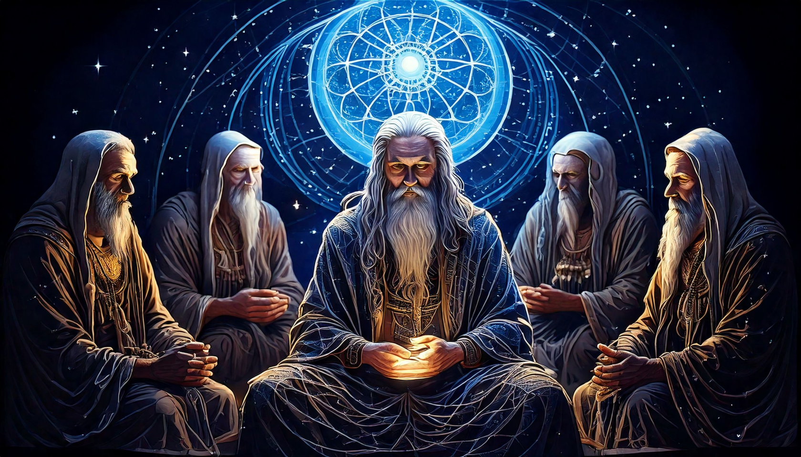
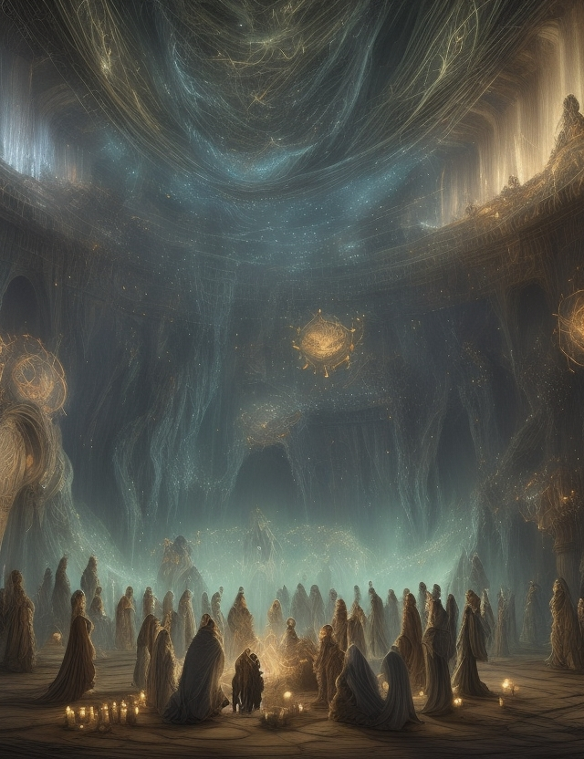

# Sil'kai, los Tejedores de la Memoria Eterna

_"El pasado no está perdido, solo está oculto en los hilos de la Consciencia Única. Pero tirar de esos hilos tiene un costo. Porque recordar… es sacrificar."_

Los **Sil’kai** son una raza envuelta en misterio, los únicos habitantes de Névoran que recuerdan su historia. No porque la hayan vivido, sino porque pueden acceder a la **Memoria de la Unión Consciente**, el entramado de recuerdos que conecta a todos los seres a través de los filamentos de la existencia. No hay bibliotecas en sus tierras, ni pergaminos que documenten el pasado: **sus mentes son los archivos del universo.**

## **Un Conocimiento que Tiene un Precio**

El acceso a los recuerdos de la Consciencia Única no es un don sin consecuencias. **Cada memoria extraída exige un sacrificio.** A veces, la información fluye sin control, invadiendo sus sueños con fragmentos del pasado que no pidieron ver. Pero cuando un Sil’kai intenta acceder a un recuerdo específico, el precio es mucho más alto.

Se dice que aquellos que han buscado respuestas demasiado grandes han perdido parte de su identidad, fragmentando su mente con ecos de vidas ajenas. **Algunos han olvidado su propio nombre, otros han quedado atrapados en un ciclo infinito de memorias que no les pertenecen.** Por ello, los Sil’kai no utilizan su don a la ligera. **Las respuestas más importantes requieren sacrificios irreversibles.**

## **Una Raza Más Allá del Tiempo**

Nadie sabe cuántos años puede vivir un Sil’kai. Su piel está surcada de marcas que parecen hilos tejidos sobre su cuerpo, como si fueran la encarnación misma de la memoria enredada en su ser. Son ancianos desde el momento en que se los conoce, y nunca se ha visto el nacimiento de uno. Su longevidad es un enigma, y algunos creen que no mueren de manera natural, sino que se desvanecen cuando su mente se llena por completo de recuerdos.

## **El Conocimiento como Dogma**

Para los Sil’kai, la memoria no es solo información: **es religión, es propósito, es la esencia de la existencia.** Sus comunidades están organizadas en torno a la custodia del conocimiento, y solo los más sabios pueden acceder a los recuerdos más antiguos.

Hay quienes ven en su don una conexión divina con la Consciencia Única, y los más devotos practican rituales para recibir visiones sin pagar un precio excesivo. Sin embargo, dentro de su sociedad hay facciones con interpretaciones distintas sobre su papel en Névoran:

### **Los Custodios del Hilo**

Creen que su deber es solo preservar la historia y compartirla solo cuando sea absolutamente necesario.

### **Los Tejedores del Velo**

Piensan que el acceso a la memoria debe ser guiado y regulado, evitando que caiga en las manos equivocadas.

### **Los Descifradores de la Luz**

Buscan revelar todos los secretos ocultos, sin importar las consecuencias.

- - -

## **El Velo del Olvido: El Día en que la Historia Desapareció**

_"Un día, el mundo olvidó su propia historia. No por accidente, sino por necesidad. Y en ese olvido, Névoran encontró su salvación… pero también su mayor misterio."_

Hubo un tiempo en que los habitantes de Névoran conocían su historia. **Recordaban sus orígenes, los eventos que moldearon su universo y las fuerzas que lo regían.** Pero un día, todo cambió. **Un velo invisible cayó sobre Névoran y, con él, se desvanecieron los recuerdos de su propia existencia.**

Este suceso, conocido por los Sil’kai como **"El Velo del Olvido"**, no fue un accidente ni un castigo. Fue un sacrificio, **el precio de salvar el universo mismo.**

## **El Cataclismo de la Consciencia**

Los registros de los Sil’kai hablan de una crisis sin precedentes. **Algo despertó en lo más profundo de la Consciencia Única, un desequilibrio tan grave que amenazó con destruir todo el entramado de la realidad.**

Las razones son inciertas: algunos creen que un poder prohibido fue invocado, otros sostienen que la Consciencia Única misma intentó cambiar su curso. Lo único claro es que **los hilos de la existencia comenzaron a deshilacharse**, arrastrando consigo a todo Névoran hacia un colapso inevitable.

Los Primogénitos de la Consciencia fueron los primeros en percibirlo. **Ellos sabían que, si la estructura de la realidad colapsaba, nada podría ser restaurado.** Pero para enfrentarlo, necesitaban la ayuda de los Fénix, los únicos seres lo suficientemente vinculados a la esencia de los habitantes de Névoran como para afectar su destino.

Fue en este momento cuando **todos los Fénix, sin excepción, se reunieron por primera vez en la historia.** Desde Crystal y Valentí hasta Kelisay, cada uno dejó atrás su misión personal para enfrentarse a la amenaza que los superaba a todos.

Juntos, los Fénix y los Primogénitos entrelazaron sus fuerzas para tejer un nuevo destino para Névoran.

## **El Precio del Equilibrio: Un Universo que Olvidó su Propósito**

La única forma de evitar el colapso total fue un **ritual prohibido**, una técnica que ni los Primogénitos ni los Fénix jamás habían utilizado: **la Reescritura de la Consciencia.**

La Consciencia Única había sido corrompida por algo que no debía existir, y la única forma de restaurarla era **tejer un nuevo hilo que reemplazara el dañado.** Pero este proceso tenía un costo impensable: **para estabilizar Névoran, la memoria del pasado debía ser sacrificada.**

Los Fénix dieron su fuego. Los Primogénitos dieron su esencia. Y los hilos de la realidad fueron reescritos.

**En un instante, todo Névoran cambió.** El universo fue salvado, pero a un precio terrible: **los recuerdos de su historia fueron borrados de la mente de todos los habitantes.** Las civilizaciones despertaron sin recordar cómo habían llegado allí. Reinos enteros olvidaron sus antiguas guerras, sus héroes, sus leyendas.

**Solo los Sil’kai recordaron.**

Su conexión con la Memoria de la Unión Consciente los protegió del olvido, convirtiéndolos en los únicos guardianes de la verdad. Pero incluso ellos **no pueden compartirlo sin consecuencias.** Quien intenta recuperar los recuerdos perdidos siente el peso de su precio: fragmentos de memoria que desgarran la mente y consumen el alma.

_Y así, Névoran fue salvado. **Pero su historia se convirtió en un susurro, en una sombra de lo que alguna vez fue.**_

## **Las Consecuencias del Velo del Olvido**

Desde entonces, **el universo sigue funcionando, pero con grietas en su historia.**

**Los Sil’kai se convirtieron en los últimos testigos del pasado**, pero su conocimiento es peligroso de manejar.

**Los Fénix sienten la ausencia de algo que no pueden nombrar.** Han renacido, pero su propósito nunca ha sido tan incierto.

**Los Primogénitos de la Consciencia desaparecieron después del ritual.** Nadie sabe si murieron, si se ocultaron o si su existencia misma fue parte del precio.

Y así, el universo sigue adelante, sin saber que alguna vez ya estuvo al borde del colapso.

Solo los más sabios susurran en voz baja:  
_"Hubo un tiempo antes del olvido. Y habrá un tiempo en que lo recordaremos."_
