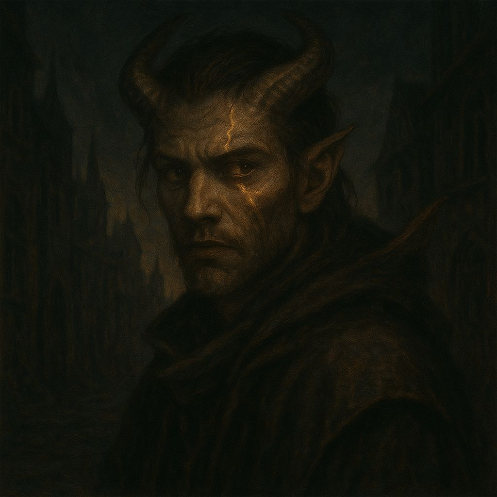
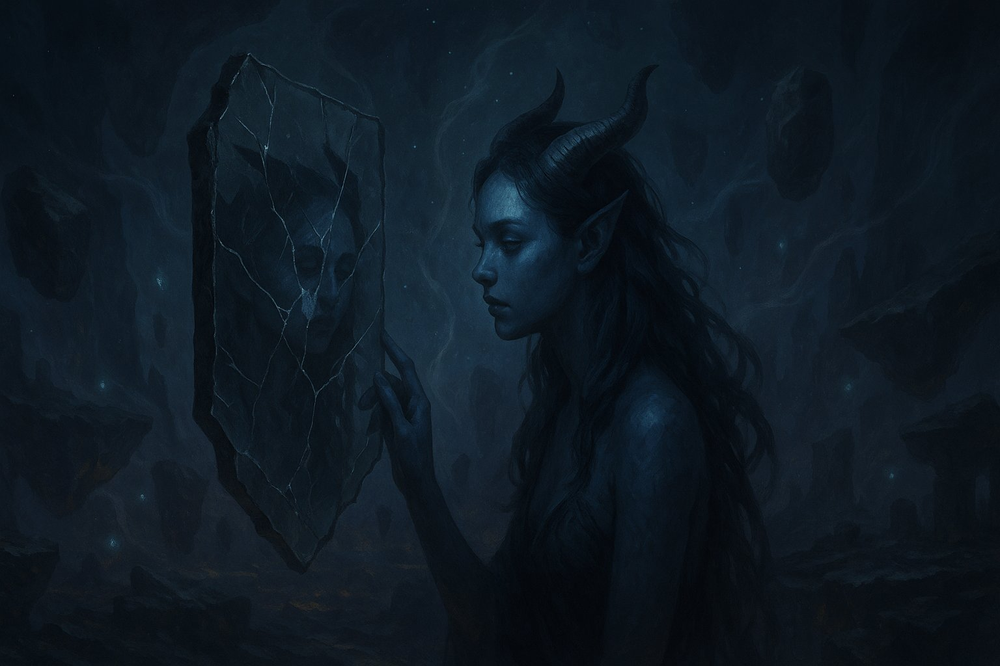
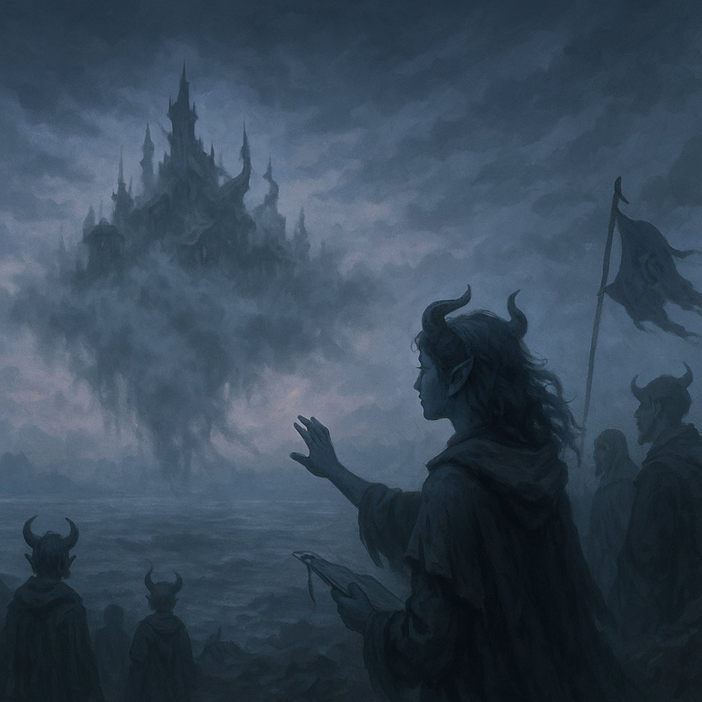
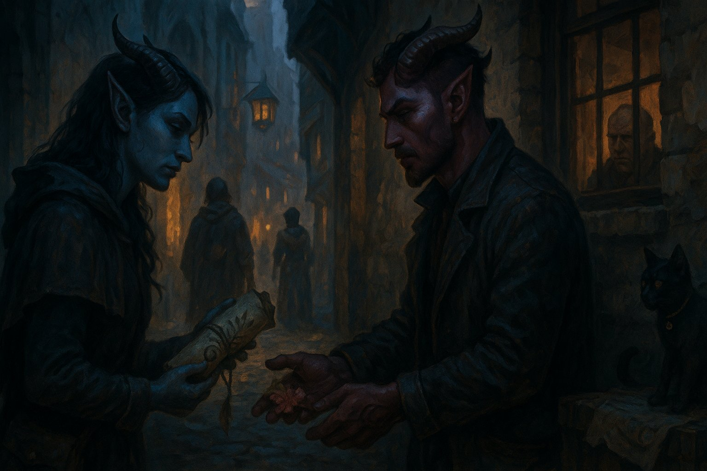

# Tieflings Errantes

Marcados desde el nacimiento por rasgos inhumanos —cuernos, ojos sin pupila, piel rojiza, azulada o ceniza— los **Tieflings** han sido objeto de superstición y exclusión durante siglos. Lo que pocos saben es que su origen no se encuentra ni en pactos oscuros ni en corrupción mágica, sino en un antiguo linaje nacido de la **interferencia de los velos entre planos**.

## **Origen y herencia**

Hace generaciones, un evento llamado **La Brecha de Niratel** rasgó momentáneamente los límites entre Névoran y otros planos de existencia. En aquel instante, ciertos mortales fueron tocados por energías foráneas —ni benignas ni malignas, simplemente ajenas—. Sus descendientes nacieron con cuerpos alterados, y la humanidad los rechazó por temor a lo desconocido. Así surgieron los Tieflings.

No responden a una religión ni a una tradición común. Su única constante es el **desarraigo**: nacen en familias que no los entienden, vagan por ciudades donde los señalan con recelo y a menudo ocultan sus rasgos para evitar el rechazo. Muchos adoptan nombres falsos, cambian de aspecto con Elantria o ilusiones, y viven bajo identidades múltiples.

## **Acontecimiento clave: El Exilio Silencioso**

En el puerto de **Rul Théren**, un grupo de Tieflings formó una comunidad en una isla flotante al borde de la niebla perpetua. Durante años, coexistieron en paz, construyendo un refugio artístico y libre. Sin embargo, un día la isla desapareció. No se oyeron gritos, no hubo restos: solo quedó un eco sordo en el agua. Desde entonces, los Tieflings lo llaman _el Exilio Silencioso_, y entre los suyos circula la creencia de que la isla aún existe, atrapada entre planos, esperando ser encontrada.

## **Relación con Névoran**

Por su apariencia, muchos Tieflings trabajan en los márgenes: **ilusionistas, contrabandistas, exploradores, artistas clandestinos o espías**. Su conexión con los velos los vuelve particularmente sensibles a lo no visible, y algunos incluso desarrollan habilidades extrasensoriales o magia intuitiva difícil de clasificar.

Aunque no tienen patria, los Tieflings Errantes han aprendido a formar vínculos entre ellos en secreto: una mirada, un gesto, un tatuaje compartido puede ser suficiente para saber que no están solos.