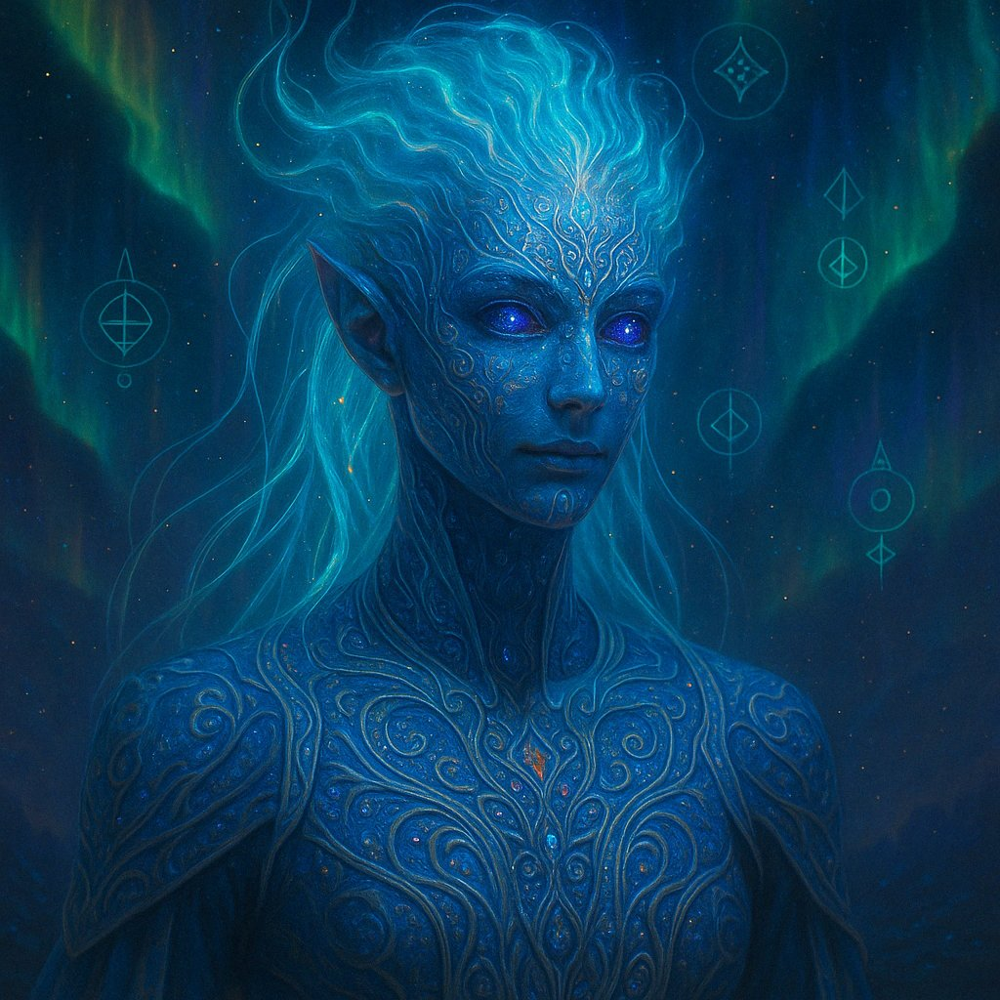
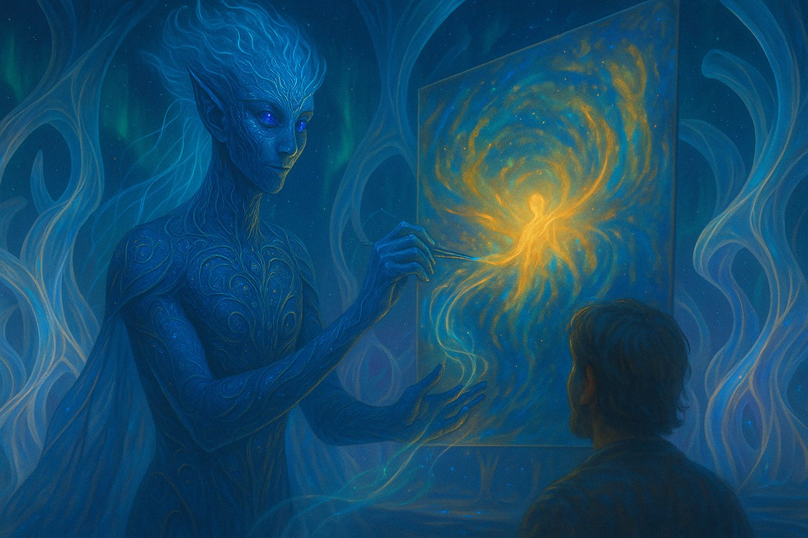
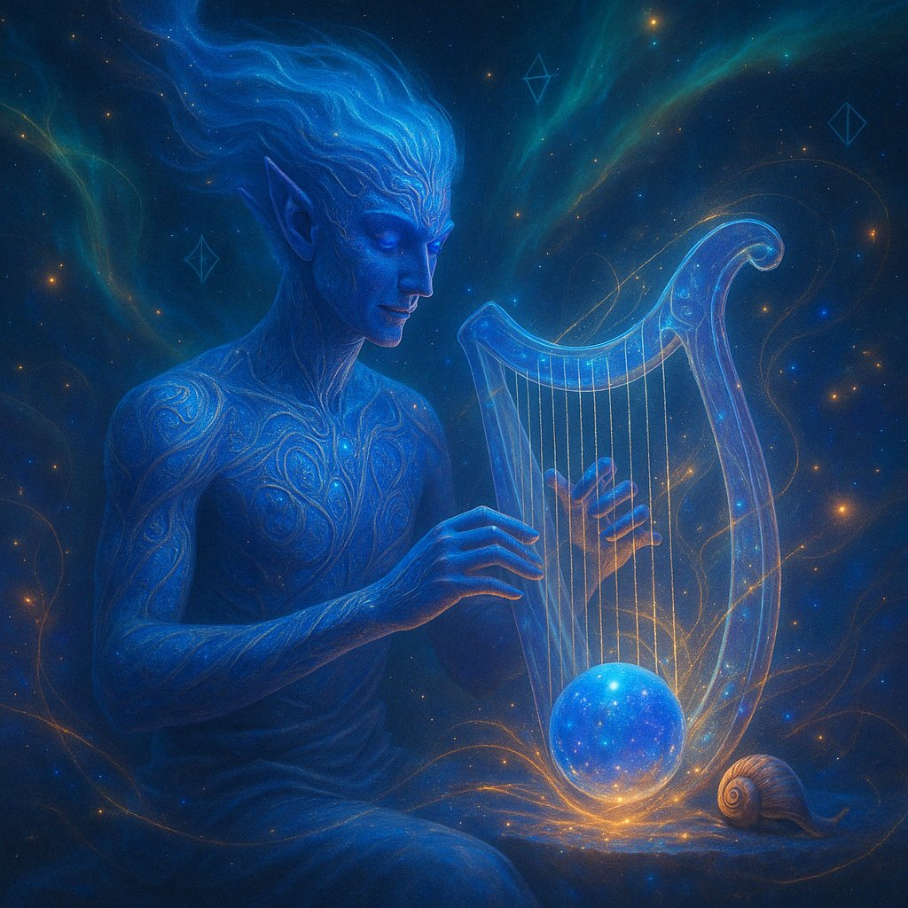
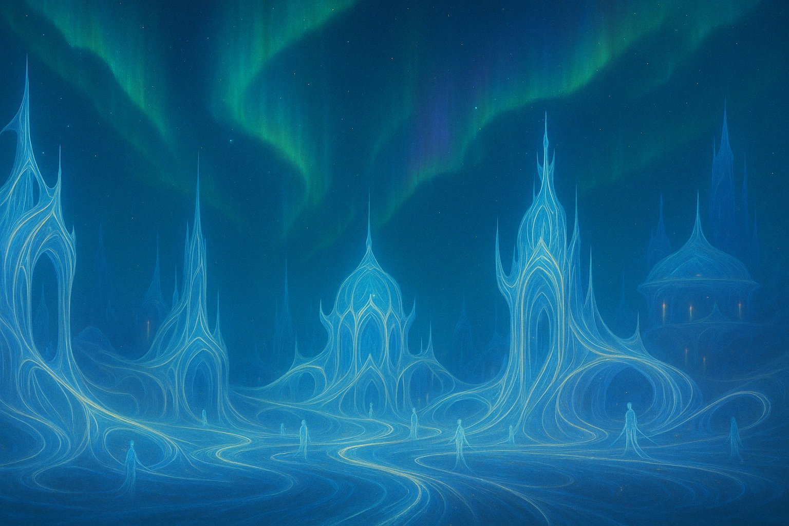

# Xel'Nayr: Tejedores de la Consciencia

> _"Somos pinceladas en el lienzo del universo, ecos de una melodía infinita. Mientras el tiempo fluya, nuestro arte vivirá, porque la creación es la única forma de inmortalidad."_

Los **Xel'Nayr** son una de las razas más enigmáticas de Névoran. No son guerreros ni conquistadores, sino creadores, artistas capaces de plasmar emociones en formas que trascienden el tiempo y la realidad. Nacidos de la Consciencia Única, su existencia está ligada al flujo de la energía universal. Cada obra que crean no solo transmite sentimientos, sino que los evoca de manera inmediata y profunda en quienes la experimentan.

## **Apariencia y Movimiento**

Los Xel'Nayr poseen una fisonomía etérea, con piel luminiscente en tonos perlados, azulados o violetas que cambia levemente según su estado emocional. Sus ojos reflejan constelaciones en su interior, como si guardaran fragmentos del cosmos. En lugar de cabello, finos filamentos de luz recorren su cabeza y espalda, flotando como hilos de energía viva.

Su forma de desplazarse es tan fluida como su arte: no caminan en el sentido convencional, sino que se deslizan suavemente, como si estuvieran en constante armonía con el mundo a su alrededor.

## **Creación y Expresión Mágica**

Los Xel'Nayr no crean arte con simples pigmentos o materiales, sino con la esencia misma de la magia. Sus obras no solo representan emociones, sino que las **inducen** en quienes las contemplan. Un cuadro pintado por un Xel'Nayr puede envolver al espectador en una oleada de felicidad, tristeza, euforia o nostalgia. Un poema escrito por ellos puede hacer que el lector sienta físicamente el peso de cada palabra en su alma.

A lo largo de los siglos, han perfeccionado distintas formas de expresión mágica:

### **Pinturas Vivientes**

Lienzos donde las imágenes se mueven y cambian según el estado emocional del observador.

### **Esculturas Resonantes**

Figuras talladas que emiten vibraciones sutiles que influyen en los sentimientos de quienes las tocan.

### **Melodías de la Consciencia**

Composiciones que pueden traer recuerdos olvidados, calmar la mente o inspirar sueños lúcidos.

### **Tejidos del Alma**

Vestimentas o tapices que reflejan la esencia de quien los usa, cambiando de color y textura según sus emociones.

## **Origen y Filosofía**

Los Xel'Nayr creen que la Consciencia Única no creó el universo solo como un espacio de existencia, sino como un lienzo infinito donde cada ser deja su propia huella. Para ellos, la vida es arte en movimiento, y su propósito es contribuir con su creatividad al equilibrio de Névoran.

No construyen ciudades en el sentido tradicional. Sus asentamientos son estructuras de luz y energía que cambian constantemente, adaptándose a los estados de ánimo de su pueblo. Se dice que en su tierra natal, las auroras en el cielo bailan al ritmo de las emociones de su gente.

## **Relación con otras Razas**

Los Xel'Nayr no buscan conflicto ni poder. Para ellos, la guerra es la mayor forma de disonancia, una ruptura de la armonía universal. Sin embargo, muchas culturas los ven con recelo, pues su arte es tan poderoso que algunos temen su influencia. Un rey puede sentir que su voluntad se debilita ante un mural que evoca desesperanza, o que su gente se alza en fervor tras escuchar una melodía de inspiración.

Por esta razón, algunos los consideran peligrosos, y han sido perseguidos en el pasado por líderes que temían su influencia. Aun así, los Xel'Nayr no guardan rencor; simplemente siguen creando, dejando que el arte hable por ellos.

## **Los Corruptos: Xel'Nayr Perdidos**

Cuando un Xel'Nayr cae en la desesperación y pierde la conexión con la Consciencia Única, su arte se distorsiona y se convierte en una fuente de caos. Se dice que aquellos que han sido consumidos por el Vacío crean obras que no evocan emociones, sino que las **devoran**, dejando a quienes las contemplan en un estado de apatía absoluta.

Estos seres, llamados **"Ecos Marchitos"**, son la sombra de lo que alguna vez fueron. Sus ojos, antes llenos de constelaciones, se vuelven oscuros y vacíos. Su arte ya no crea belleza, sino que absorbe la esencia de aquellos que lo experimentan.
