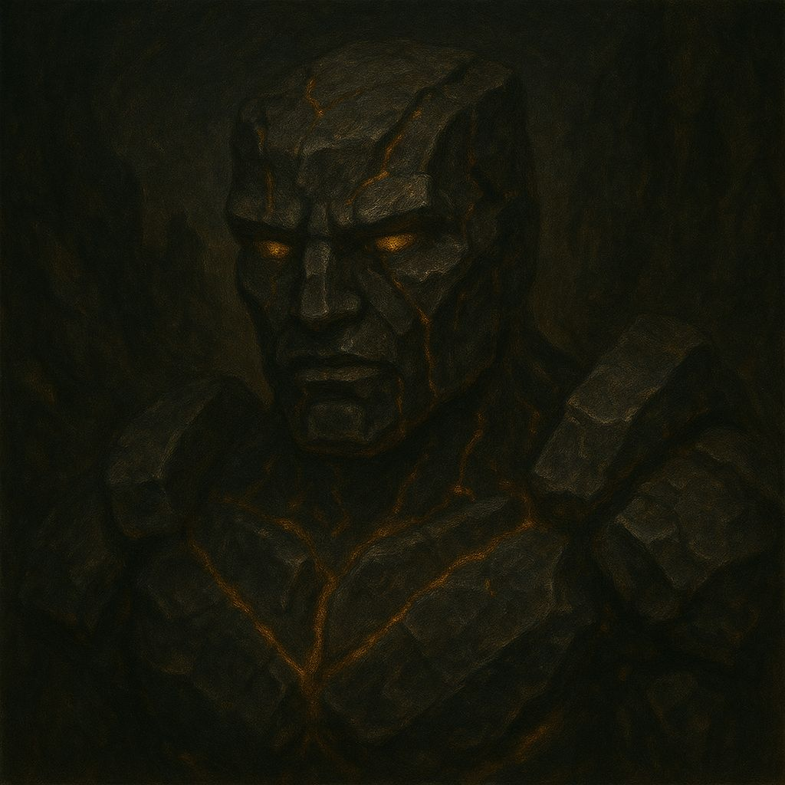
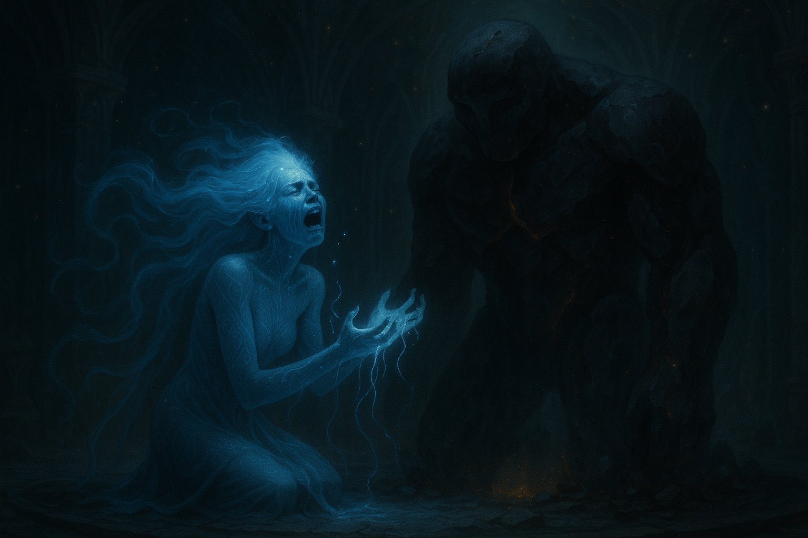
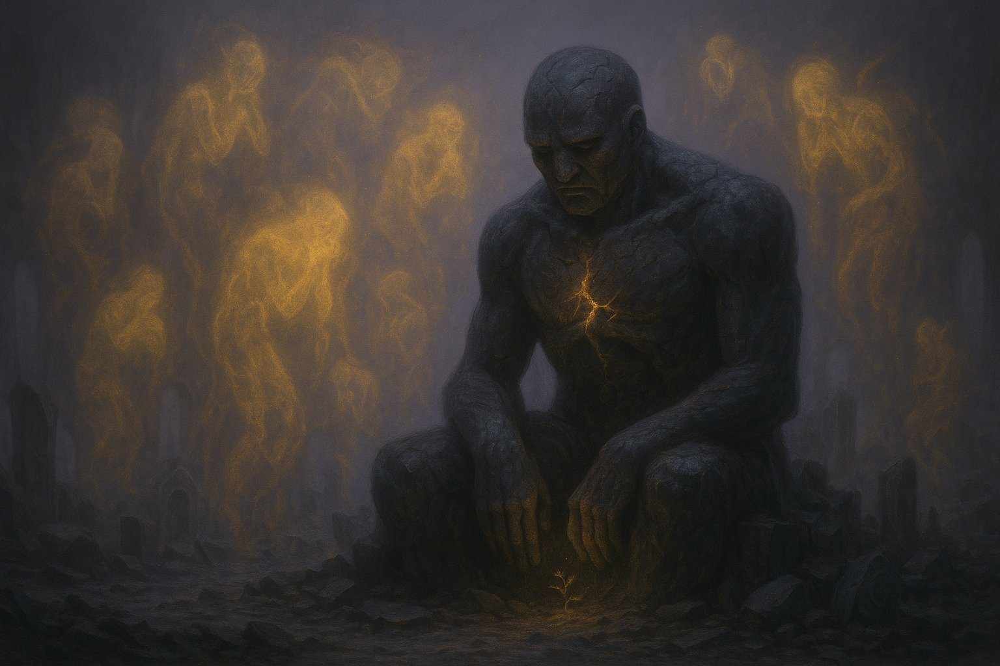
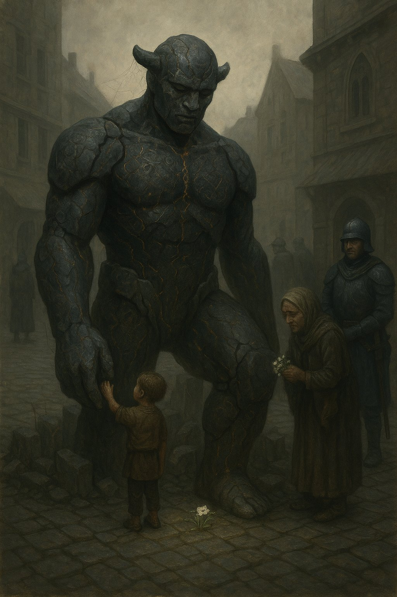

# Xel'Oxim - Gólems de Onix

Los **Gólems de Ónix** no son simples constructos mágicos: son **emoción cristalizada**, moldeada en roca viva por los Xel’Nayr. Nacidos no del capricho ni del combate, sino de la necesidad de expresar aquello que no podía decirse con palabras, los gólems son obras de arte viviente, guardianes de memorias imborrables y portadores de heridas antiguas.

## **Origen y propósito**

Entre los Xel’Nayr, el dolor profundo no se reprime: se transforma. Cuando una emoción se vuelve demasiado intensa para ser contenida —una pérdida, un duelo colectivo, una traición—, los artistas más hábiles pueden canalizarla en un ritual llamado **Resonancia Profunda**. Durante este proceso, una escultura de ónix se forma lentamente con la ayuda de cristales resonantes y hilos de la Consciencia Única, hasta cobrar vida.

Cada gólem nace con un propósito emocional específico: **guardar, llorar, proteger, recordar o advertir**. Su aspecto varía, pero suelen ser imponentes, con cuerpos tallados de manera simbólica: fisuras, runas, máscaras parciales o formas que evocan figuras perdidas. La mayoría no habla, pero puede comunicarse a través de pulsos de luz, gestos ceremoniales o vibraciones que solo los Xel'Nayr comprenden plenamente.

## **Acontecimiento clave: El Silencio de Therai**

Durante el exterminio de un pequeño enclave Xel’Nayr a manos de colonos humanos (cuyo nombre fue borrado de los cantos), los sobrevivientes llevaron a cabo una Resonancia Profunda masiva. De esa catarsis nació **Therai**, el primer gólem de ónix con conciencia propia. Caminó hacia el lugar de la masacre, se sentó sobre las ruinas, y allí permanece desde entonces. No se mueve, no ataca, no habla. Pero quienes se acercan dicen sentir en su pecho un peso inmenso, como si su corazón recordara cosas que no vivió.

## **Relación con Névoran**

Los gólems de ónix activos son escasos y dispersos. Algunos yacen dormidos en galerías subterráneas, templos olvidados o museos sin público. Otros caminan, solitarios, por regiones deshabitadas. Pocos se aventuran a perturbarlos: su mera presencia impone respeto, y las comunidades que conviven cerca de uno suelen adoptar costumbres de silencio y recogimiento, como si intuyeran que los gólems sienten más de lo que muestran.

A diferencia de otras creaciones mágicas, los gólems de ónix no pueden ser controlados. **No obedecen órdenes, solo emociones**. Y cuando uno de ellos se activa, siempre hay una historia que está por salir a la luz… o una tragedia a punto de repetirse.
