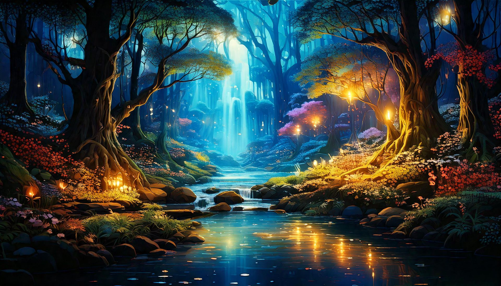

# Región Fyrniel

Fyrniel es la región más vibrante de Névoran, caracterizada por sus bosques luminosos llenos de árboles gigantes y flores bioluminiscentes que brillan en la oscuridad. Las cascadas cristalinas alimentan ríos que reflejan el cielo lleno de estrellas. Criaturas mágicas como ciervos con cuernos luminosos o aves con plumas doradas habitan este lugar. Todo emana una energía pacífica y próspera.

<iframe width="560" height="315" src="https://www.youtube.com/embed/24P1P3dsz10?si=-pigg_Z3M9kFvj5w" title="YouTube video player" frameborder="0" allow="accelerometer; autoplay; clipboard-write; encrypted-media; gyroscope; picture-in-picture; web-share" referrerpolicy="strict-origin-when-cross-origin" allowfullscreen></iframe>
