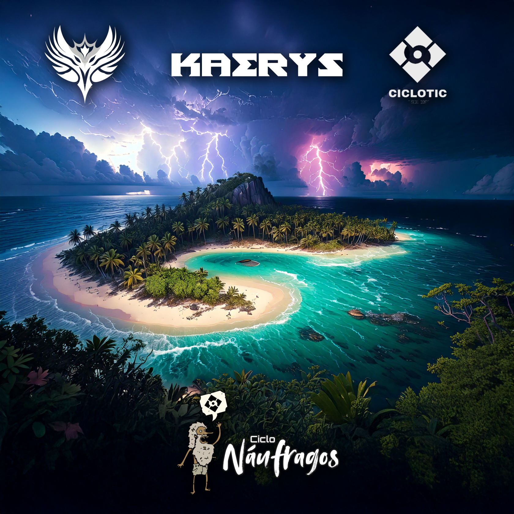

# Kaerys, la Isla del Último Refugio

> Kaerys es el fin del camino para algunos, y un nuevo comienzo para otros. Aquí, no hay reyes ni reinos, solo los que el océano ha elegido para quedarse. Porque en esta isla, no se sobrevive solo... se renace.

Oculta en los límites desconocidos de Névoran, **Kaerys** es una isla perdida en la inmensidad del océano. Se dice que pocas embarcaciones han llegado hasta sus costas, y las que lo hicieron nunca regresaron. En su centro, protegido por densos bosques y escarpadas montañas, se encuentra un oasis próspero, un santuario de vida en medio del aislamiento.

<iframe width="560" height="315" src="https://www.youtube.com/embed/_zyGb7wl-C0?si=KMJZNSuUCW6dub0A" title="YouTube video player" frameborder="0" allow="accelerometer; autoplay; clipboard-write; encrypted-media; gyroscope; picture-in-picture; web-share" referrerpolicy="strict-origin-when-cross-origin" allowfullscreen></iframe>

## **Un refugio para los olvidados**

Kaerys no aparece en ningún mapa. Solo quienes han sido arrastrados por la furia del mar o perseguidos por su pasado han encontrado su camino hasta esta tierra. Se dice que la isla es un imán para los perdidos, un último refugio para los náufragos que no tienen otro hogar.

Los primeros en asentarse fueron marineros cuyos barcos fueron destruidos en una tormenta sin precedentes. Al encontrar el oasis, decidieron quedarse y construir una nueva sociedad lejos de los reinos de Névoran. A lo largo de los años, fugitivos, exploradores y aventureros se sumaron, formando una comunidad diversa de supervivientes.

## **Geografía y Ecosistema**

Kaerys es una isla de contrastes. En sus costas, playas blancas y arrecifes de coral rodean el perímetro, pero mar adentro, densos manglares y selvas espesas ocultan los secretos de la isla. Solo los más osados se han aventurado a cartografiar sus montañas, pues entre sus riscos se ocultan ruinas de una civilización perdida.

El corazón de la isla es el **Oasis de Karoh**, un lago cristalino rodeado de palmeras y formaciones rocosas cubiertas de musgo. Su agua es más pura que la de cualquier manantial conocido, y algunos creen que posee propiedades mágicas, permitiendo a los habitantes de Kaerys vivir más tiempo o curar heridas rápidamente.

## **Los Hijos del Naufragio**

La sociedad que habita Kaerys se conoce como **Los Hijos del Naufragio**. No tienen un líder absoluto, sino que se organizan en un consejo formado por los supervivientes más experimentados. Creen que la isla los eligió, y que si intentaran abandonarla, el océano los reclamaría.

Se han adaptado a vivir con lo que la isla les ofrece: construyen viviendas de madera reciclada, pescan en los arrecifes y cultivan en pequeñas parcelas cerca del oasis. Pero su mayor secreto son las ruinas escondidas entre las montañas: templos y monolitos cubiertos de inscripciones que sugieren que Kaerys no siempre estuvo deshabitada.

## **Misterios de la Isla**

### **Las Ruinas de Vhyris**

Antiguos templos cubiertos de símbolos desconocidos. Algunos creen que pertenecieron a una civilización pre-élfica, mientras que otros piensan que los Primogénitos de la Consciencia alguna vez pisaron estas tierras.

### **Las Tormentas Encadenadas**

Ningún barco puede salir de Kaerys, pues una tormenta permanente rodea la isla. Algunos dicen que es una maldición, otros creen que es un hechizo protector.

### **El Guardián del Oasis**

Se rumorea que una criatura ancestral duerme en las profundidades del lago, observando a los habitantes y protegiendo el equilibrio de la isla.