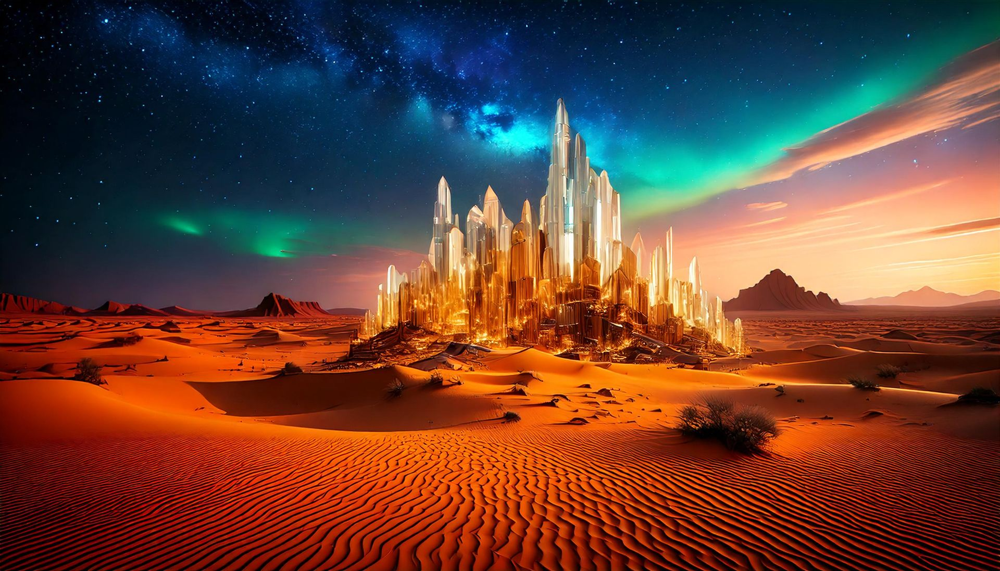
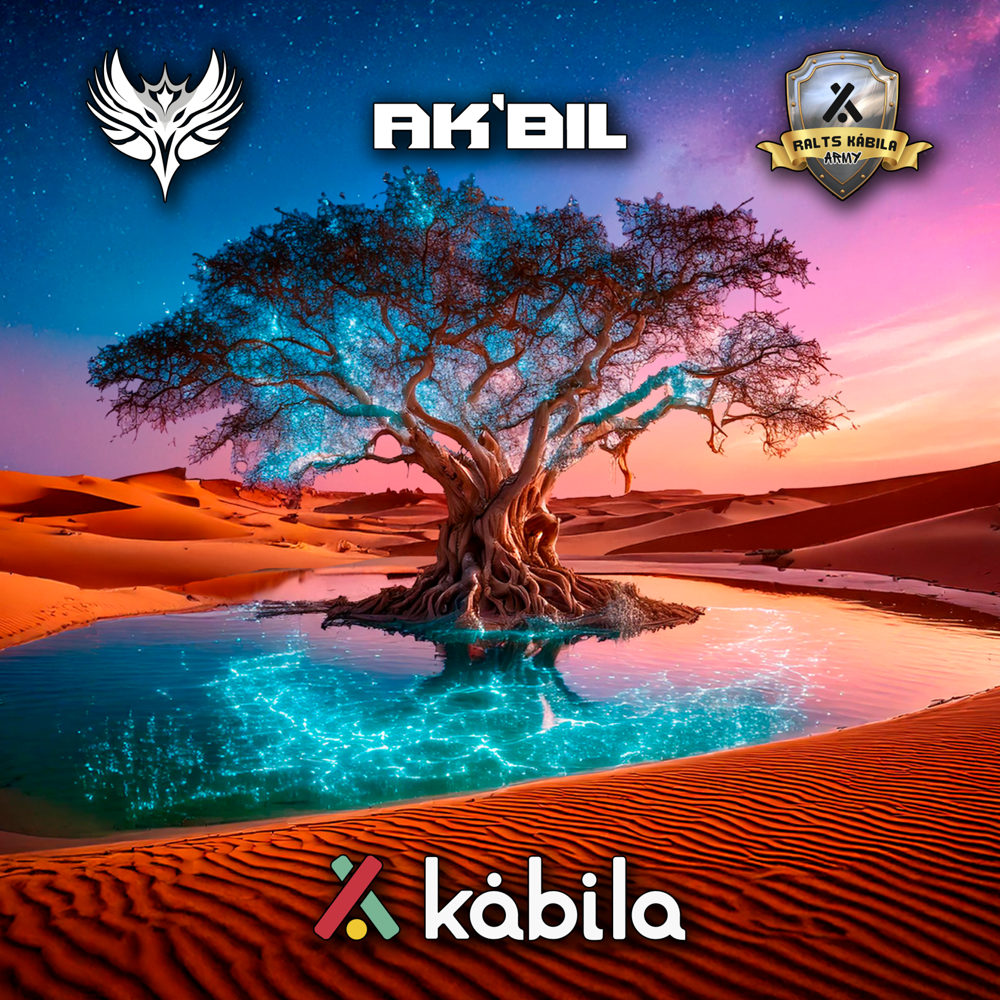

# Kormirth

Kormirth es una región desértica, con extensas dunas de arena dorada y estructuras cristalinas que sobresalen del paisaje. El cielo está en constante movimiento, cubierto por auroras mágicas y tormentas eléctricas que iluminan las ruinas antiguas de una civilización olvidada. Este lugar transmite misterio y un poder latente, como si el desierto guardara secretos enterrados.

<iframe width="560" height="315" src="https://www.youtube.com/embed/x7gfMDzgKJA?si=UgXXpiDdHkL007b9" title="YouTube video player" frameborder="0" allow="accelerometer; autoplay; clipboard-write; encrypted-media; gyroscope; picture-in-picture; web-share" referrerpolicy="strict-origin-when-cross-origin" allowfullscreen></iframe>

## **Ak'bil, el Oasis de los Creadores Perdidos**

> **_En el corazón de Kormirth, donde la arena devora el tiempo, aguarda Ak’bil. No es un oasis para quienes buscan agua, sino para quienes buscan significado. Bebe de sus aguas y encuentra tu camino, pero recuerda: el viaje nunca termina, solo cambia de forma._**

En las infinitas dunas de **Kormirth**, donde el sol quiebra la arena con su calor implacable y el viento silba canciones de soledad, existe un lugar que pocos han visto y aún menos han comprendido: **Ak’bil, el oasis de los creadores perdidos**.

No aparece en los mapas, ni sigue las rutas conocidas. Dicen que solo aquellos que han caminado lo suficiente, aquellos cuyas fuerzas comienzan a flaquear, pueden encontrarlo. **Ak’bil no es solo agua en medio del desierto, es un susurro del destino, un refugio para quienes buscan dejar su huella en el mundo y creen haber perdido el camino.**

Los aventureros que llegan hasta sus aguas describen la misma sensación: **una ligereza en el alma, como si el peso de sus fracasos y dudas se disipara por un instante.** No es un oasis normal; su lago, de aguas cristalinas con un leve resplandor plateado, parece reflejar no solo la imagen de quien lo mira, sino lo que podría llegar a ser.

Junto al lago crecen árboles de hojas azuladas que susurran palabras en un idioma olvidado. Algunos aseguran que, si uno escucha con atención, las ramas cuentan historias de viajeros que alguna vez se perdieron, pero que encontraron en Ak’bil la claridad para seguir adelante.

### **El Secreto de Ak’bil**

<iframe width="560" height="315" src="https://www.youtube.com/embed/80NkMWqJjos?si=zbChM991bayW1bGQ" title="YouTube video player" frameborder="0" allow="accelerometer; autoplay; clipboard-write; encrypted-media; gyroscope; picture-in-picture; web-share" referrerpolicy="strict-origin-when-cross-origin" allowfullscreen></iframe>

Aunque muchos creen que se trata de un oasis común alimentado por fuentes subterráneas, **los Xel’Nayr sostienen que Ak’bil es un fragmento de la Consciencia Única, un lugar nacido del deseo de crear y avanzar.** No es solo agua lo que sana a quienes llegan a sus orillas, sino la certeza de que, aunque el camino sea incierto, la creación nunca se detiene.

Los que logran beber de Ak’bil y comprender su verdadero propósito **no vuelven igual que cuando llegaron**. Retoman su viaje con una nueva claridad, con ideas renovadas y con la certeza de que su obra aún no ha terminado.

Algunos dicen que el oasis desaparece y reaparece con el tiempo, como si eligiera a quienes lo necesitan. Otros creen que siempre ha estado ahí, pero solo se muestra a aquellos que han caminado lo suficiente para merecerlo.

Lo único cierto es que **Ak’bil no es un lugar de descanso eterno, sino un punto de inflexión.** A quienes se quedan demasiado tiempo, el oasis les susurra suavemente que su viaje aún no ha terminado… y que es hora de volver a crear.