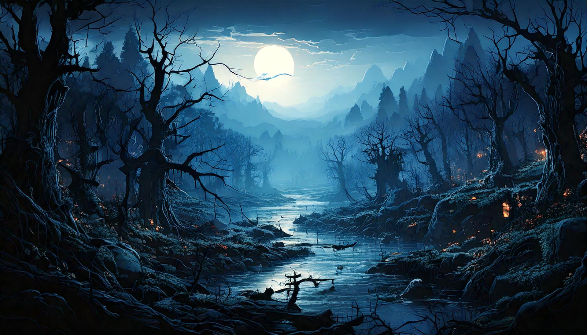

# Mírganor

Mírganor es una región oscura y misteriosa, dominada por bosques sombríos y montañas envueltas en neblina. Los árboles tienen ramas retorcidas y hojas oscuras, y entre ellos, criaturas nocturnas observan en silencio. Pequeñas luces fantasmales flotan entre los árboles, y un río negro serpentea a través del paisaje. La atmósfera es opresiva, pero hermosa, con un aire gótico y enigmático.

<iframe width="560" height="315" src="https://www.youtube.com/embed/a-ZaKZvzV_k?si=XT1EIdIAw0plBJyW" title="YouTube video player" frameborder="0" allow="accelerometer; autoplay; clipboard-write; encrypted-media; gyroscope; picture-in-picture; web-share" referrerpolicy="strict-origin-when-cross-origin" allowfullscreen></iframe>
